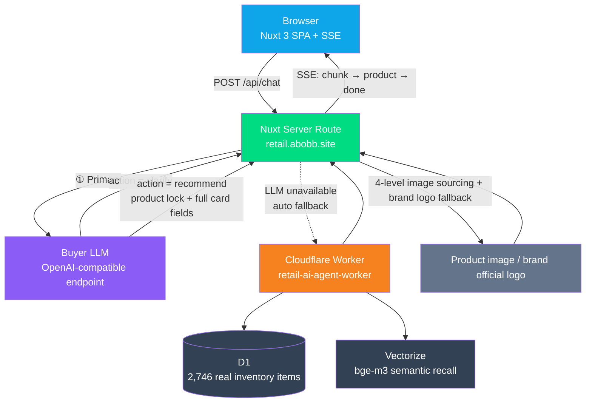

<p align="center"><a href="./README.md">简体中文</a> | <b>English</b></p>

<div align="center">

<picture>
  <source media="(prefers-color-scheme: dark)" srcset="./docs/images/logo-white.png" />
  
</picture>

# Retail AI Agent

**An AI recommendation system for retail sales assistance. Describe your scenario in one sentence of Chinese, and get back a real product card you can order right away.**

No keyword search, and no dumping a screenful of listings. It works more like a veteran buyer stationed in the store: it listens to your full scenario first —
if there isn't enough information, it asks only the single most critical question; once there's enough, it locks onto **one** real, in-stock model,
explains "why this one, who it doesn't fit, and how to narrow it down next" in one go, and leaves a link to the official site.
The entire pipeline is designed around one principle: "if any single link dies, the user should never see a blank screen or a 5xx."

[**retail.abobb.site**](https://retail.abobb.site) &nbsp;·&nbsp; [retail.abobb.com](https://retail.abobb.com) &nbsp;·&nbsp; [Worker API](https://retail-ai-agent-worker.abobb-retail-ai-agent.workers.dev) &nbsp;·&nbsp; [Issues](https://github.com/abobb414/Retail-AI-Agent/issues)

[](./LICENSE)
[](#tech-stack)
[](#architecture)
[](#testing)
[](#architecture)
[](#features)

</div>

---

## Preview

<table>
<tr>
<td colspan="2" align="center"><b>Desktop</b></td>
</tr>
<tr>
<td colspan="2" align="center"></td>
</tr>
<tr>
<td colspan="2" align="center"><sub><b>Home</b> · welcome message + three quick-start scenarios</sub></td>
</tr>
<tr>
<td colspan="2" align="center"></td>
</tr>
<tr>
<td colspan="2" align="center"><sub><b>One round of conversation</b> · the buyer LLM locks onto a model directly and produces the product card</sub></td>
</tr>
<tr>
<td colspan="2" align="center"><b>Mobile</b></td>
</tr>
<tr>
<td width="50%" align="center"></td>
<td width="50%" align="center"></td>
</tr>
<tr>
<td align="center"><sub><b>Home</b> · welcome message + quick-start scenarios</sub></td>
<td align="center"><sub><b>One round of conversation</b> · product locking and the product card</sub></td>
</tr>
</table>

> All four screenshots are taken live from `retail.abobb.site`, unedited. The "one round of conversation" is a **real dialogue**: the user says
> 「夏天通勤穿的半袖，预算 300 以内，男士，身高 175cm，平时穿 L 码」 ("Short-sleeve shirts for summer commuting, budget under 300, men's, 175cm tall, usually wear size L"), and the buyer LLM locks onto a model and produces the card in a single round.

---

## Features

### 🎯 When to ask a clarifying question, when to lock a product

This project is not an e-commerce search box, nor a chatbot that only makes small talk. It validates an experience closer to **in-store sales assistance**:

- When information is insufficient, **ask only the single most critical question** (e.g., "Is it for a man or a woman? Also give me height/weight or usual size") — no card is produced;
- When information is sufficient, **lock directly onto one model** — no dumping twenty candidates for the user to sift through; instead it gives scenario-specific reasons, who it fits and who it doesn't, and how to narrow it down next;
- Budget, audience, and category constraints from a multi-turn session are inherited, but the previous round's requirements are never wrongly carried into the next round's independent product locking;
- Product models, specs, and prices **must never be fabricated** — better to say less than to make things up;
- When the model occasionally "returns prose where a structured result was expected," that prose is **recycled as the clarifying-question body** — not treated as a failure, and completely invisible to the user.

### 🖼️ Product images: four-level image sourcing + brand logo fallback

The `image` field from the model is always left empty; the backend finds images itself, in four levels:

| Level | Source | Notes |
|---|---|---|
| ① | Source page `og:image` | Re-fetches `source_url` in the field, with SSRF guards, per-hop redirect validation, and a 512KB read cap |
| ② | Brand official-domain image | If the source page yields nothing, fetch from the brand's official domain |
| ③ | Targeted matching on brand official domains | The candidate image's description must explicitly name the target model |
| ④ | Third-party images | Must pass **visual QC** (the image is actually sent to a multimodal model to check for watermarks / model match / whether it's a real product photo) |

If all four levels come up empty, it falls back to the **brand official logo** (official-domain favicon / official site `og:image`, with real pixel parsing and a `MIN_LOGO_SIDE = 32` gate),
and the card switches to a "logo + model" layout; only if even the logo can't be probed does it show a text placeholder. **A wrong image is harder to spot than no image, so better to leave it empty.**

### 🔗 The "Visit official site" button is always there

The image verification verdict **only decides "whether to use this image," not "whether to provide this entry point."**
Even if all images are rejected and the link is judged stale, the official-site entry point is kept — this is a deliberate decoupling; see item 2 of [Engineering Notes](#engineering-notes-pitfalls-we-hit).

### ⚡ Jitter never bothers the user

- Three consecutive failures from the same provider trigger a **90-second circuit breaker cooldown**, so users don't repeatedly wait out timeouts for nothing.
- Transport-layer jitter (`fetch failed` / `ECONNRESET` / `socket hang up`) gets 3 retries with backoff; **timeout-class errors are never retried**.
- During fallback, the frontend shows only a unified three-dot waiting animation, **exposing no internal pipeline details** — no provider badges, no internal stage names.
  (`meta.engine` is still sent to the frontend, but only used for internal state and troubleshooting.)

---

## Engineering Notes: Pitfalls We Hit

This project has 6,000+ lines of frontend code + 1,500+ lines of Worker code, but a substantial chunk of those lines went into **places that look unimportant but can be fatal**. Every item below was genuinely hit in practice:

<table>
<tr><th width="30%">Symptom</th><th width="70%">Root cause & fix</th></tr>
<tr>
<td><b>A third-party site's favicon posing as the "brand official logo"</b></td>
<td>To achieve zero latency, brand logo probing was kicked off <b>in parallel before source verification</b> — at that moment <code>source_url</code> was still the raw address the model provided, which is often a third-party page. So favicons from smzdm / JD / Zhihu got pasted onto product cards as brand logos.<br/><b>Using a third-party site's icon as brand endorsement is worse than no image at all.</b> The fix was adding an <code>isBrandOfficialHost</code> gate — non-official domains never enter the candidate pool; if nothing can be probed, honestly leave it empty.<br/>Lesson: <b>parallelization silently invalidates timing assumptions like "this field has already been validated"</b> — the premises in comments must be re-reviewed together with execution order.</td>
</tr>
<tr>
<td><b>The "Visit official site" button disappearing entirely</b></td>
<td>The original source-verification logic was "on 404, clear both <code>source_url</code> and the images" and "if there's no image after redirects, the link doesn't count either." That looked reasonable when the image was the only consumer, but the frontend button is <code>v-if="source_url"</code> ⇒ <b>clearing the link = the button disappears entirely</b>, and the hit rate for official-site entries of niche brands dropped to nearly 0.<br/>The fix was <b>decoupling</b> the two concerns: verification only decides "whether to use this image," not "whether to provide this entry point." After the fix, two consecutive batch runs scored 8/8.</td>
</tr>
<tr>
<td><b>An ICO clearly containing 32×32 judged as "too small" and discarded</b></td>
<td>An ICO is a container; one file can hold both 16×16 and 32×32 at the same time. Reading only the first directory entry kills good logos by mistake (a certain camera brand's ICO was exactly this). You must <b>iterate over all directory entries and take the largest side</b>.</td>
</tr>
<tr>
<td><b>Guessing resolution from byte count — wrong in both directions</b></td>
<td>A 473-byte icon can be a legitimate 16×16, and a 3KB ICO can still be 16×16. Byte count is not a resolution criterion — switch to <b>actually parsing the pixels</b>, then set a <code>MIN_LOGO_SIDE = 32</code> gate.</td>
</tr>
<tr>
<td><b>Returns 200, but isn't an image</b></td>
<td>Some <code>*/favicon.ico</code> endpoints return <code>200 + text/html</code>, and some ICO containers actually hold PNGs. Do <b>magic-number sniffing</b> before applying the gate.</td>
</tr>
<tr>
<td><b>The image QC timeout was actually only applied to "failing" samples</b></td>
<td>Candidates in the same batch are judged <b>in parallel</b>, so batch wall time = the slowest image; and the one that can't be judged will always hit the ceiling. At 25s, one bad sample stalls the entire batch for 25s (the logs showed three consecutive <code>judgeMs:25005</code> + aborted entries; a single test case accumulated 58.9s of QC). Cutting it to 12s more than halved the worst batch, and the cost (the rare 12–25s slow successes) is caught by the brand logo fallback.</td>
</tr>
<tr>
<td><b>Budget gate placed in the wrong spot, throwing away good images too</b></td>
<td>The total budget gate in the image sourcing stage <b>may only gate the "level entry point," never individual image QC</b>. We tried gating per image: one round of targeted sourcing from the official domain ate the whole budget, and then the <b>entire batch</b> of QC was rejected as "budget exhausted" — good images that would have passed got thrown out with it.</td>
</tr>
<tr>
<td><b>Changed the default value but it didn't take effect</b></td>
<td>Code default was 15s, but <code>.env</code> said 25s — 25s was in effect, and I had only changed one of them. <code>.env</code> overrides code defaults; I only located it via the actual millisecond values in the logs.</td>
</tr>
<tr>
<td><b>Transport jitter mistaken for "the upstream is down"</b></td>
<td>Within the same minute, the relay station, image sources, and <b>several otherwise unrelated hosts all</b> <code>fetch failed</code> simultaneously ⇒ the upstream services weren't unstable — <b>the local outbound link was failing in waves</b> (lasting a dozen-plus seconds). The original "retry once + fixed 800ms" could never survive that.<br/>Switched to backoff retries of <code>[800, 1600]ms</code> × 3, plus one counterintuitive rule: <b>slow failures are not retried</b> — if a single attempt already burned ≥5s, the link itself is broken; otherwise 3 × 40s can drag the user out to two minutes. Also, undici's collapsed one-liner <code>fetch failed</code> is now unwrapped layer by layer along the <code>error.cause</code> chain — without that, debugging is pure guesswork.</td>
</tr>
<tr>
<td><b>The model replying in "prose" was judged as service unavailable</b></td>
<td>The model is inherently unstable on "lock a product vs. ask a clarifying question" — sometimes it just asks a question in natural language without emitting JSON. Judging the whole request as "LLM temporarily unavailable" was a <b>false positive</b> — the model was fine, it just didn't emit JSON. Changed to: if after retries it's still non-JSON and the content is non-empty ⇒ <b>recycle as the clarifying-question body</b>; only throw when the content is genuinely empty.</td>
</tr>
<tr>
<td><b>A reasoning model "appearing to have no vision"</b></td>
<td><code>content</code> returned an empty string + <code>finish_reason=length</code>; the answer was actually written in <code>reasoning_content</code>. Image requests trigger longer thinking and hit this more easily, and the symptom (empty string) is easy to misread as "the model has no vision capability." After raising <code>max_tokens</code> to 4096, the same request answered normally — <b>don't take "empty content returned" as the model lacking capability</b>.</td>
</tr>
<tr>
<td><b>The model-token extractor treating hostnames and dimensions as model numbers</b></td>
<td><code>g-search3.alicdn.com</code> yielded a <code>SEARCH3</code> token, and the <code>9X2</code> inside <code>ATS-909X2</code> was taken as a dimension — the result was candidate images being <b>silently dropped</b> as "model conflict": 8 niche brands, 0 images through the gate, and the logs showed nothing anomalous.<br/>Fix: strip the hostname before extracting tokens; change the dimension regex to <code>\d{2,5}[xX×]\d{2,5}</code> (requiring ≥2 digits on both sides); change match semantics from "equal" to "contains" (tokens in URLs get glued to their neighbors).</td>
</tr>
<tr>
<td><b>Confusing the "backup LLM" with the "product catalog fallback"</b></td>
<td>"API with only one provider" was once over-interpreted as "remove the entire fallback chain too," deleting the safety net against LLM crashes. The two are completely different in nature: the backup LLM is <b>the same exit with a different model</b> (relay-station jitter is link-level; switching models won't save it), while the catalog fallback is <b>an entirely different data source</b> (depends on no LLM at all).<br/>The moment it was deleted, the frontend's <code>engine === 'catalog'</code> branch instantly became unreachable dead code — while the frontend wasn't changed by a single line.</td>
</tr>
</table>

---

## Architecture



The design principle is that **every block can degrade independently** — any external dependency dying should never leave the user with a blank screen or a 5xx:

- **Product locking**: buyer LLM → catalog RAG (an entirely different data source, no LLM dependency)
- **Product images**: source page `og:image` → brand official-domain image → targeted matching on official domains → third-party images (with QC) → brand official logo → text placeholder
- **Outbound jitter**: backoff retries → circuit breaker cooldown → fallback
- **Frontend**: only when both pipelines are down does it return 503, and it reports each pipeline's failure reason separately

> ⚠️ The backend (the Worker in `index.ts` + D1 + Vectorize) lives in this repo but is an **independent Cloudflare project**,
> deployed separately via `wrangler.jsonc`, decoupled from the frontend on Vercel.

### Request flow priority

1. Nuxt receives the frontend message and first hands the full conversation to the buyer LLM for product locking.
2. The LLM returns `action = clarify` → emit one clarifying question only, no card.
3. The LLM returns `action = recommend` → lock the single product and produce all card fields in one shot; Nuxt maps them directly into the frontend structure.
4. When the LLM is unavailable, **automatically fall back to the catalog fallback**, where the Worker runs "D1 exact recall first + Vectorize semantic fallback."
5. `meta.engine` is `llm` / `catalog`, used only for internal state and troubleshooting; the frontend shows no provider badges.

---

## Tech Stack

| | |
|---|---|
| Frontend | Nuxt 3 · Vue 3 · Tailwind CSS (custom five-tier type-scale tokens `ui-label / ui-meta / ui-body / ui-title / ui-display`) |
| Frontend hosting | Vercel |
| API proxy | Nuxt server route (`frontend/server/api/chat.post.ts`) |
| First-choice product locking | Buyer LLM (OpenAI-compatible Chat Completions, default `deepseek-v4.1-flash`) |
| Product image QC | The same multimodal pipeline (candidate images are actually sent to the model to judge watermark / model match / real product photo) |
| Catalog fallback | Cloudflare Worker + D1 + Vectorize + Workers AI Embedding (`bge-m3`) |
| Import scripts | Node.js + curl |

### Performance

| Metric | Measured |
|---|---|
| Fallback pipeline, direct to Worker | **0.18s** (three samples: 0.19 / 0.17 / 0.18) |
| Primary pipeline · fast path | **7.6s** to first text segment |
| Primary pipeline · full path (incl. image sourcing and per-image QC) | 30–70s, high variance; the long tail is mostly the parallel wall clock of the image stage |
| Per-image QC | Successful verdicts cluster at 2.4–9.3s |
| First-paint HTML (incl. inline styles) | 26.8 KB → gzip **7.5 KB** |
| First-paint JS (two chunks) | 194 KB → gzip **73 KB** |

> Why the image stage is slow: candidate images are judged **in parallel**, so the batch wall clock equals the slowest image,
> and the failing one always maxes out the timeout. That's why `IMAGE_JUDGE_TIMEOUT_MS` was tightened from 25s to 12s —
> it mostly acts on failing samples. See item 6 of [Engineering Notes](#engineering-notes-pitfalls-we-hit).

---

## Quick Start

Frontend:

```bash
cd frontend
npm install
cp .env.example .env   # fill in LLM_API_KEY, etc.
npm run dev            # → http://127.0.0.1:3000
```

Worker (optional — only if you want to modify the fallback pipeline):

```bash
npx wrangler deploy --dry-run   # dry-run first
npx wrangler deploy
```

Production build check:

```bash
cd frontend
npm run build
```

> **Note**: the Worker fallback pipeline requires `WORKER_CHAT_URL` to point at a deployed Worker.
> If you leave it empty during local debugging, only the primary pipeline is available — an LLM failure will error out directly; that's expected behavior.

---

## Testing

Two suites: **offline regression** (no network, no dev server needed) and **system tests** (full-pipeline runs against a live instance).

### System test · 7 scenarios, 30 assertions

| Scenario | Coverage |
|---|---|
| `S1` Static serving | Homepage HTTP 200, page shell intact |
| `S2` SSE protocol | Event sequence is legal, every `data` is parseable JSON, ends with `done`, waiting events carry `pending` and **contain no internal copy** |
| `S3` Clarifying flow | With insufficient info, asks one question first and produces no product card |
| `S4` Product-locking flow | With sufficient info, locks a single product with all key card fields present |
| `S5` Multi-turn context | A full conversation (question → answer → budget supplement) is followed correctly |
| `S6` Empty-input fallback | An empty message list returns guidance copy instead of a 5xx |
| `S7` Fallback pipeline | In `--fallback` mode, asserts `engine=catalog` and a real card is produced |

```bash
node scripts/system-test.mjs https://retail.abobb.site
node scripts/system-test.mjs http://127.0.0.1:3100 --smoke      # only S1/S2/S6, no LLM calls
node scripts/system-test.mjs http://127.0.0.1:3101 --fallback   # assert the fallback pipeline against the fault-injected instance
```

> Latest live batch run: **30 passed / 0 failed**.
> Note that `S4` depends on the specific model: when the model happens to choose "clarify" over "locking" in a given round, it goes red once; rephrase to "a request with an explicit model name" and it reproduces reliably — this is not a pipeline failure.

### Offline regression

| Script | Scale | What it pins down |
|---|---|---|
| `test-natural-dialogues.mjs` | **30 cases** | Natural-dialogue regression: behavior baseline for clarify / locking / multi-turn |
| `test-catalog-intent.mjs` | **42 cases** (21 profile + 21 clarify) | Intent recognition and clarifying-question phrasing across categories, audiences, budgets |
| `test-brand-logo.mjs` | **9 cases** | Guards against third-party favicons posing as brand official logos (includes 16 third-party domain classes that must be blocked) |
| `test-image-model-tokens.mjs` | 5 noisy URLs × 31 noise words + 6 real model numbers + 2 conflict verdicts + 4 brand tokens | Guards against "model-conflict misjudgment" throwing away good images |

```bash
node --experimental-strip-types scripts/test-brand-logo.mjs
node --experimental-strip-types scripts/test-image-model-tokens.mjs
node --experimental-strip-types scripts/test-catalog-intent.mjs
```

> `test-brand-logo.mjs` registers a resolve hook for `data:` URLs that appends `.ts` to **extension-less** relative imports in the source —
> bare Node's ESM resolver doesn't accept that style, while Nuxt/Vite does. In batch output this class of bug **only shows up as "the image host is a third-party domain," which reads like noise**, so a test must pin it down.

### End-to-end & probes

```bash
# End-to-end for niche / long-tail products: product locking + image selection + official-site button + timing
node scripts/test-cold-products.mjs 3100
node scripts/test-cold-products.mjs 3100 --only=手冲壶   # 手冲壶 = pour-over kettle

# Vision capability probe: can the relay-station model actually see images (includes with-image / without-image controls)
node scripts/probe-vision.mjs <baseUrl> <apiKey> <model> [imagePath]
```

---

## Directory Structure

```text
.
├── index.ts                         # Cloudflare Worker: import, cleaning, RAG retrieval, product locking
├── wrangler.jsonc                   # Worker / D1 / Vectorize / Workers AI bindings
├── catalogTaxonomy.ts               # Product category and attribute vocabularies
├── migrations/
│   ├── 001_expand_products_for_rag.sql
│   └── 002_catalog_facets.sql
├── scripts/                         # Tests, import, probes (see scripts/README.md)
│   ├── system-test.mjs              # System test: 7 scenarios, 30 assertions
│   ├── test-natural-dialogues.mjs   # Offline regression: 30 natural-dialogue cases
│   ├── test-catalog-intent.mjs      # Offline regression: 42 category-intent cases
│   ├── test-brand-logo.mjs          # Offline regression: 9 brand-logo domain candidate cases
│   ├── test-image-model-tokens.mjs  # Offline regression: model-token extraction
│   ├── test-cold-products.mjs       # End-to-end: niche long-tail products
│   ├── probe-vision.mjs             # Vision capability probe
│   ├── import-real-products.mjs     # Bulk import of products into D1 + Vectorize
│   ├── normalize-product-catalog.mjs# Generate structured categories & attributes from the real catalog
│   └── migrate-products-schema.mjs  # D1 schema upgrades
├── frontend/
│   ├── pages/index.vue              # Main chat interface
│   ├── composables/useChat.ts       # SSE chat state management
│   ├── components/                  # Message list, input bar, recommendation card, quick entries
│   ├── server/api/chat.post.ts      # LLM-first product locking → catalog fallback
│   ├── server/api/image.get.ts      # Product image proxy (SSRF guard)
│   ├── server/utils/
│   │   ├── llmBuyer.ts              # Buyer product-locking provider layer (tool calls / timeouts / fault tolerance / circuit breaker / image sourcing orchestration)
│   │   ├── sourcePage.ts            # Source verification: re-fetch product page, grab og:image, drop dead links
│   │   ├── imageJudge.ts            # Product image visual QC
│   │   ├── imageTrust.ts            # Official-domain rules and image trustworthiness gate
│   │   ├── brandLogo.ts             # Brand official logo candidates and probing
│   │   ├── modelTokens.ts           # Model-token extraction and conflict verdicts
│   │   ├── transport.ts             # Outbound retry / backoff / error unwrapping
│   │   └── catalog*.ts              # Categories, intent, and filtering for the fallback pipeline
│   ├── server/data/                 # Product data sources + structured facets
│   └── assets/css/main.css          # Five-tier type-scale tokens
├── docs/
│   ├── PRD.md
│   └── images/                      # README preview images
├── CHANGELOG.md
├── LICENSE
└── README.md
```

---

## Environment Variables

### Frontend / Vercel

```env
# Primary: buyer product-locking LLM (OpenAI-compatible endpoint)
LLM_API_KEY=your_llm_api_key
LLM_BASE_URL=https://e-flowcode.cc/v1
LLM_MODEL=deepseek-v4.1-flash
LLM_TIMEOUT_MS=40000

# Product image visual QC: candidate images are actually sent to a multimodal model
# to judge watermark / model match / whether it's a real product photo.
# Set to 0 to disable and revert to the old "brand official domains only" rule
IMAGE_JUDGE=1
IMAGE_JUDGE_MODEL=                 # leave empty to reuse LLM_MODEL
IMAGE_JUDGE_TIMEOUT_MS=12000

# 🔴 Fallback: catalog pipeline (takes over product locking when the LLM is unavailable,
# guaranteeing a card can still be produced). This is the safety net — don't delete it.
WORKER_CHAT_URL=https://retail-ai-agent-worker.abobb-retail-ai-agent.workers.dev/api/chat
# Optional: pin the Worker domain to this IP to bypass domestic DNS resolution issues.
# For local debugging, leave empty to use normal DNS
WORKER_RESOLVE_IP=
```

### Worker Bindings

Configured in [`wrangler.jsonc`](wrangler.jsonc):

| Binding | Resource |
|---|---|
| `env.DB` | D1 database `retail-ai-agent-db` |
| `env.VECTOR_INDEX` | Vectorize index `retail-ai-agent-products-bge-m3` |
| `env.AI` | Workers AI (Embedding) |

### Model selection notes

Measured latency for the same product-locking request: `deepseek-v4.1-flash` **6.2s**, `doubao-seed-2.0-lite` 6.7s,
`qwen3.8-flash` 37.9s, `glm-5.3-flash` 39–92s (reasoning model; `max_tokens` easily gets eaten by the thinking process).
When switching to a reasoning model, remember to raise `LLM_TIMEOUT_MS` accordingly.

**Vision capability must be tested per model — don't extrapolate from the series**:

| Model | Image request | Result |
|---|---|---|
| `glm-5.3-flash` | `image_url` (Base64 Data URL or remote URL) | ✅ Recognizes correctly; even 2MB large images get through |
| `deepseek-v4.1-flash` | `image_url` | ✅ Recognizes correctly |
| `glm-5.3` | `image_url` | ❌ HTTP 400 — **same family, yet no vision** |

> `usage.prompt_tokens_details.image_tokens` is always `0` on relay stations, so it **cannot** be used to judge whether an image got through.
> The product side currently has no image input entry (text input only), and the server doesn't assemble `image_url` content blocks either — the model being able to see images ≠ the app being able to use images.

---

## API Contract

### Frontend Proxy · `POST /api/chat`

```json
{ "messages": [{ "role": "user", "content": "男士通勤半袖100元以内" }] }
```

(The `content` value above means "Men's short-sleeve for commuting, under 100 yuan" — kept in Chinese as the real request payload.)

The response is SSE:

| Event | Content |
|---|---|
| `chunk` | Sales-assistant reply text |
| `product` | Frontend recommendation card data |
| `meta` | Stage and fallback reason (internal state; the frontend shows no provider badges) |
| `done` | Stream end |
| `error` | Error message |

Before product locking begins, a `{ "pending": true, "stage": "thinking" }` is sent first; the frontend shows only the unified three-dot waiting animation and renders no waiting copy.

When falling back to the catalog, `meta` looks like:

```json
{
  "mode": "catalog",
  "engine": "catalog",
  "stage": "rag_recommendation",
  "fallback_reason": "大模型定品失败：deepseek-v4.1-flash 处于熔断冷却期",
  "profile_summary": []
}
```

(The `fallback_reason` value above is kept in Chinese as the real production behavior; it reads "Product locking by the LLM failed: deepseek-v4.1-flash is in circuit-breaker cooldown.")

### Worker Chat · `POST /api/chat`

```json
{ "message": "男士通勤半袖100元以内" }
```

(Same Chinese message as above: "Men's short-sleeve for commuting, under 100 yuan.")

Returns `chat_reply` + `recommended_product` (with `name` / `brand` / `price_display` / `image` / `url` / `why_buy` / `next_step_tip`) and `stage`.

---

## Data Import & Migration

```bash
# Upgrade the D1 products table
D1_DATABASE_NAME=retail-ai-agent-db node scripts/migrate-products-schema.mjs

# Small-batch smoke-test import
WORKER_URL=https://<worker> LIMIT=5 BATCH_SIZE=8 CONCURRENCY=1 \
  node scripts/import-real-products.mjs

# Resume from a checkpoint
WORKER_URL=https://<worker> START_INDEX=500 BATCH_SIZE=8 CONCURRENCY=1 \
  node scripts/import-real-products.mjs
```

See [scripts/README.md](scripts/README.md) for detailed parameters.

---

## Deployment

```bash
# Frontend (set the Vercel Project's Root Directory to `frontend`)
cd frontend && vercel deploy --prod --yes

# Worker
npx wrangler deploy
```

---

## Quality Boundaries

**Handled**

- Primary pipeline failure automatically falls back to the catalog, with consecutive-failure circuit breaking to avoid repeatedly waiting out timeouts.
- When a reasoning model's `content` gets squeezed empty by the thinking process, `max_tokens` is automatically raised and the request retried.
- Relay-station Cloudflare blocking (403 for unusual UAs) is already worked around in the server request headers.
- Multi-turn budget chaining fixed; hard filters on explicit category, audience, and budget (fallback pipeline).
- The model's occasional "prose replies" are recycled as the clarifying-question body, not treated as failures.
- Transport-layer jitter gets automatic backoff retries; **slow failures are not retried**.
- Product images: four-level image sourcing + brand logo fallback + text placeholder — any single link failing doesn't affect card production.

**Still improvable**

- **No authenticity verification for products from the primary pipeline**: the model can still produce models that don't exist or have been discontinued.
- **Worst-case latency is on the high side**: the current degradation is serial — "primary fails → then fallback" — so the worst case is `LLM_TIMEOUT_MS` running to the max and then stacking the fallback on top.
  This could be changed to hedged requests (fire the fallback in parallel if the primary hasn't responded after 8s; first success wins) to bring the worst-case latency down too.
- **High variance in the image stage**: the batch wall clock equals the slowest candidate image; the long tail can reach 70s. Possible directions: make image sourcing and product locking **truly parallel**,
  or emit a text card first and patch in the image when it arrives.
- **Brand logo fallback has a limited hit rate**: it only works when the brand's official-domain icon can be probed; some official domains are unreachable from certain network environments, in which case a text placeholder is shown.
- **No session state persistence**: the locked state relies entirely on the model re-reading the conversation history each turn.
- Make `category` a proper D1 field instead of runtime inference; add request logging, recall-hit explanations, and an observability dashboard.
- Add rate limiting, authentication, and a more complete production security policy.

---

## Documentation

- [Product Requirements (PRD)](docs/PRD.md)
- [Changelog](CHANGELOG.md)
- [Scripts guide](scripts/README.md)

## License

[MIT](./LICENSE)

<div align="center"><sub>Product data comes from publicly available sales channels and is used solely to demonstrate the sales-assistance pipeline; product images and brand logos are copyrighted by their respective brands.</sub></div>
