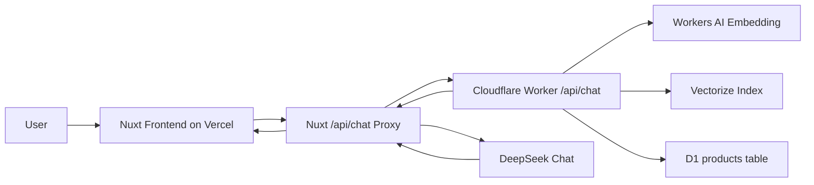

# Retail AI Agent

Retail AI Agent 是一个面向零售导购场景的 AI 推荐原型。项目把 Nuxt 前端、Cloudflare Workers、D1、Vectorize、Workers AI 和 DeepSeek 组合成一条完整链路：用户用自然语言表达需求，系统先从真实商品库检索并锁定候选，再生成可直接渲染的导购回复与商品卡片。

线上演示：

- Frontend: [https://retail.abobb.site](https://retail.abobb.site)
- Worker API: [https://retail-ai-agent-worker.abobb-retail-ai-agent.workers.dev](https://retail-ai-agent-worker.abobb-retail-ai-agent.workers.dev)


## 项目定位

这个项目不是传统电商搜索框，也不是只会闲聊的客服机器人。它验证的是一个更接近线下导购的体验：

- 信息不足时先追问关键条件，而不是立即硬推商品。
- 用户给出品类、预算、性别、场景后，从真实商品库中召回候选。
- 最终卡片中的商品名称、价格、图片和官网链接必须来自 D1 真实数据。
- LLM 只负责把推荐理由写得更自然，不允许改商品事实字段。

更完整的产品需求见 [docs/PRD.md](docs/PRD.md)。

## 当前能力

- 支持中文自然语言导购，例如“男士通勤半袖 100 元以内”“小卧室想更舒服，灯光 300 元”。
- 支持多轮会话中的预算、人群和品类约束，不会把上一轮需求错误带入下一轮独立选品。
- 使用 D1 存储商品结构化字段，使用 Vectorize 存储商品向量。
- 使用 Workers AI `@cf/baai/bge-m3` 生成查询和商品 Embedding。
- 使用 Worker 端规则过滤保证品类、预算、人群不跑偏。
- 使用 DeepSeek 只润色卡片文案，真实商品字段由 Worker/D1 锁定。
- 前端通过 SSE 渲染对话文本、商品卡片、推荐状态和重置会话。

## 架构概览



核心原则是“先锁商品，再写文案”：

1. Nuxt 接收前端消息，并判断最新消息是否应作为独立选品请求。
2. Worker 将用户问题向量化，并结合 D1 关键词召回与 Vectorize 语义召回。
3. Worker 对候选商品做预算、人群、品类过滤和排序。
4. Worker 返回锁定后的真实商品字段。
5. Nuxt 调用 DeepSeek 生成更自然的导购文案，但只合并可润色字段。
6. 前端展示 SSE 文本和结构化商品卡片。

## 技术栈

| 层级 | 技术 |
| --- | --- |
| 前端 | Nuxt 3, Vue 3, Tailwind CSS |
| 前端部署 | Vercel |
| API 代理 | Nuxt server route |
| RAG 中枢 | Cloudflare Worker |
| 商品数据库 | Cloudflare D1 |
| 向量检索 | Cloudflare Vectorize |
| Embedding | Workers AI `@cf/baai/bge-m3` |
| 文案润色 | DeepSeek Chat Completions |
| 导入脚本 | Node.js + curl |

## 项目结构

```text
.
|-- index.ts                         # Cloudflare Worker: 导入、清洗、RAG 检索、商品锁定
|-- wrangler.jsonc                   # Worker、D1、Vectorize、Workers AI 绑定
|-- migrations/
|   `-- 001_expand_products_for_rag.sql
|-- scripts/
|   |-- import-real-products.mjs      # 批量导入商品到 D1 + Vectorize
|   |-- migrate-products-schema.mjs   # D1 表结构升级脚本
|   `-- README.md
|-- frontend/
|   |-- pages/index.vue               # 主聊天界面
|   |-- composables/useChat.ts        # SSE 聊天状态管理
|   |-- components/                   # 消息、输入栏、推荐卡片、状态栏
|   |-- server/api/chat.post.ts       # Nuxt 代理 + DeepSeek 文案润色
|   |-- server/api/image.get.ts       # 商品图代理
|   |-- server/data/realProducts.json # 商品数据源
|   |-- nuxt.config.ts
|   `-- vercel.json
|-- docs/
|   |-- PRD.md
|   `-- images/
|-- CHANGELOG.md
|-- LICENSE
`-- README.md
```

## 环境变量

### Nuxt / Vercel

```env
WORKER_CHAT_URL=https://retail-ai-agent-worker.abobb-retail-ai-agent.workers.dev/api/chat
WORKER_RESOLVE_IP=104.21.35.251
DEEPSEEK_API_KEY=your_deepseek_api_key
DEEPSEEK_BASE_URL=https://api.deepseek.com
DEEPSEEK_MODEL=deepseek-chat
```

### Cloudflare Worker Bindings

这些绑定在 [wrangler.jsonc](wrangler.jsonc) 中配置：

- `env.DB`: D1 database `retail-ai-agent-db`
- `env.VECTOR_INDEX`: Vectorize index `retail-ai-agent-products-bge-m3`
- `env.AI`: Workers AI binding

## 本地开发

安装并启动前端：

```bash
cd frontend
npm install
npm run dev
```

前端默认访问：

- [http://127.0.0.1:3000](http://127.0.0.1:3000)

生产构建检查：

```bash
cd frontend
npm run build
```

Worker dry run：

```bash
npx wrangler deploy --dry-run
```

## 数据导入与迁移

升级 D1 商品表：

```bash
D1_DATABASE_NAME=retail-ai-agent-db node scripts/migrate-products-schema.mjs
```

小批量烟测导入：

```bash
WORKER_URL=https://retail-ai-agent-worker.abobb-retail-ai-agent.workers.dev \
LIMIT=5 \
BATCH_SIZE=8 \
CONCURRENCY=1 \
node scripts/import-real-products.mjs
```

断点续跑：

```bash
WORKER_URL=https://retail-ai-agent-worker.abobb-retail-ai-agent.workers.dev \
START_INDEX=500 \
BATCH_SIZE=8 \
CONCURRENCY=1 \
node scripts/import-real-products.mjs
```

## API 契约

### Frontend Proxy

`POST /api/chat`

请求：

```json
{
  "messages": [
    { "role": "user", "content": "男士通勤半袖100元以内" }
  ]
}
```

响应为 SSE：

- `chunk`: 导购回复文本
- `product`: 前端推荐卡片数据
- `meta`: 当前链路状态
- `done`: 流结束
- `error`: 错误信息

### Worker Chat

`POST /api/chat`

请求：

```json
{
  "message": "男士通勤半袖100元以内"
}
```

响应：

```json
{
  "chat_reply": "这款男式短袖更贴近你的条件，可以先看。",
  "recommended_product": {
    "id": "muji-4548076062684",
    "name": "男式 天竺编织 圆领短袖T恤",
    "brand": "MUJI",
    "category": "T恤/短袖",
    "price_display": "CNY 78",
    "image": "https://...",
    "url": "https://...",
    "why_buy": "它属于短袖上衣，价格在 100 元预算内。",
    "ideal_for": [],
    "avoid_for": [],
    "next_step_tip": "下一步先看官网尺码、库存和实拍细节。"
  },
  "stage": "rag_recommendation"
}
```

## 部署

### Cloudflare Worker

```bash
npx wrangler deploy
```

### Vercel Frontend

Vercel Project 的 Root Directory 设置为 `frontend`。

```bash
cd frontend
vercel deploy --prod --yes
```

## 质量边界

已处理：

- 商品事实字段锁定，避免模型幻觉 SKU。
- 多轮预算串联修复。
- 显式品类、人群和预算硬过滤。
- 新会话重置。
- DeepSeek 文案润色失败时自动回退 Worker 文案。

仍可增强：

- 将 `category` 作为 D1 正式字段，而不是运行时推导。
- 增加请求日志、召回命中解释和可观测面板。
- 为商品导入增加更细的失败批次恢复报告。
- 引入速率限制、鉴权和更完整的生产安全策略。

## 文档

- [PRD](docs/PRD.md)
- [更新日志](CHANGELOG.md)
- [导入脚本说明](scripts/README.md)

## License

[MIT License](LICENSE)
