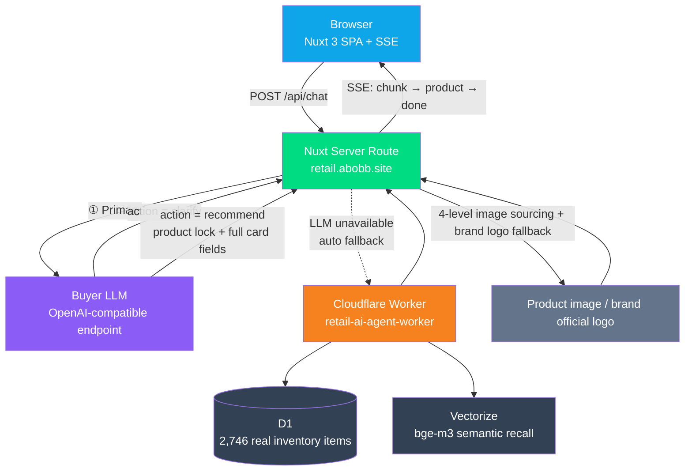
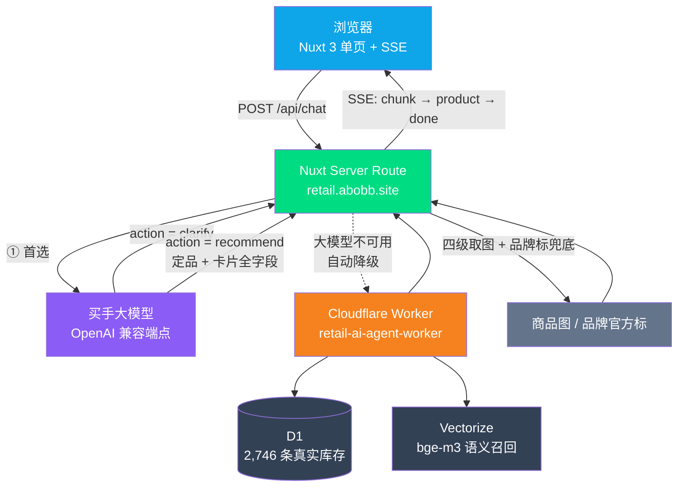

<div align="center">

# Retail AI Agent

**面向零售导购场景的 AI 推荐系统。一句中文说清你的场景，回你一张能直接下单的真实商品卡。**

不做关键词搜索，也不甩一屏列表。它更像守在店里的老买手：先听你把场景说完 ——
信息不够，就只问最关键的那一句；信息够了，直接锁定**一款**真实在售的型号，
把「为什么是它、谁不适合、下一步怎么挑」一次讲完，并留好跳转官网的入口。
整条链路按「任何一环挂掉，都不该让用户看到白屏或 5xx」来设计。

[**retail.abobb.site**](https://retail.abobb.site) &nbsp;·&nbsp; [retail.abobb.com](https://retail.abobb.com) &nbsp;·&nbsp; [Worker API](https://retail-ai-agent-worker.abobb-retail-ai-agent.workers.dev) &nbsp;·&nbsp; [Issues](https://github.com/abobb414/Retail-AI-Agent/issues)

[](./LICENSE)
[](#技术栈)
[](#架构)
[](#测试)
[](#架构)
[](#特性)

</div>

<details>
<summary><b>English</b>（点击展开英文版 · Click to expand）</summary>

<div align="center">

# Retail AI Agent

**An AI recommendation system for retail sales assistance. Describe your scenario in one sentence of Chinese, and get back a real product card you can order right away.**

No keyword search, and no dumping a screenful of listings. It works more like a veteran buyer stationed in the store: it listens to your full scenario first —
if there isn't enough information, it asks only the single most critical question; once there's enough, it locks onto **one** real, in-stock model,
explains "why this one, who it doesn't fit, and how to narrow it down next" in one go, and leaves a link to the official site.
The entire pipeline is designed around one principle: "if any single link dies, the user should never see a blank screen or a 5xx."

[**retail.abobb.site**](https://retail.abobb.site) &nbsp;·&nbsp; [retail.abobb.com](https://retail.abobb.com) &nbsp;·&nbsp; [Worker API](https://retail-ai-agent-worker.abobb-retail-ai-agent.workers.dev) &nbsp;·&nbsp; [Issues](https://github.com/abobb414/Retail-AI-Agent/issues)

[](./LICENSE)
[](#tech-stack)
[](#architecture)
[](#testing)
[](#architecture)
[](#features)

</div>

---

## Preview

<table>
<tr>
<td colspan="2" align="center"><b>Desktop</b></td>
</tr>
<tr>
<td colspan="2" align="center"></td>
</tr>
<tr>
<td colspan="2" align="center"><sub><b>Home</b> · welcome message + three quick-start scenarios</sub></td>
</tr>
<tr>
<td colspan="2" align="center"></td>
</tr>
<tr>
<td colspan="2" align="center"><sub><b>One round of conversation</b> · the buyer LLM locks onto a model directly and produces the product card</sub></td>
</tr>
<tr>
<td colspan="2" align="center"><b>Mobile</b></td>
</tr>
<tr>
<td width="50%" align="center"></td>
<td width="50%" align="center"></td>
</tr>
<tr>
<td align="center"><sub><b>Home</b> · welcome message + quick-start scenarios</sub></td>
<td align="center"><sub><b>One round of conversation</b> · product locking and the product card</sub></td>
</tr>
</table>

> All four screenshots are taken live from `retail.abobb.site`, unedited. The "one round of conversation" is a **real dialogue**: the user says
> 「夏天通勤穿的半袖，预算 300 以内，男士，身高 175cm，平时穿 L 码」 ("Short-sleeve shirts for summer commuting, budget under 300, men's, 175cm tall, usually wear size L"), and the buyer LLM locks onto a model and produces the card in a single round.

---

## Features

### 🎯 When to ask a clarifying question, when to lock a product

This project is not an e-commerce search box, nor a chatbot that only makes small talk. It validates an experience closer to **in-store sales assistance**:

- When information is insufficient, **ask only the single most critical question** (e.g., "Is it for a man or a woman? Also give me height/weight or usual size") — no card is produced;
- When information is sufficient, **lock directly onto one model** — no dumping twenty candidates for the user to sift through; instead it gives scenario-specific reasons, who it fits and who it doesn't, and how to narrow it down next;
- Budget, audience, and category constraints from a multi-turn session are inherited, but the previous round's requirements are never wrongly carried into the next round's independent product locking;
- Product models, specs, and prices **must never be fabricated** — better to say less than to make things up;
- When the model occasionally "returns prose where a structured result was expected," that prose is **recycled as the clarifying-question body** — not treated as a failure, and completely invisible to the user.

### 🖼️ Product images: four-level image sourcing + brand logo fallback

The `image` field from the model is always left empty; the backend finds images itself, in four levels:

| Level | Source | Notes |
|---|---|---|
| ① | Source page `og:image` | Re-fetches `source_url` in the field, with SSRF guards, per-hop redirect validation, and a 512KB read cap |
| ② | Brand official-domain image | If the source page yields nothing, fetch from the brand's official domain |
| ③ | Targeted matching on brand official domains | The candidate image's description must explicitly name the target model |
| ④ | Third-party images | Must pass **visual QC** (the image is actually sent to a multimodal model to check for watermarks / model match / whether it's a real product photo) |

If all four levels come up empty, it falls back to the **brand official logo** (official-domain favicon / official site `og:image`, with real pixel parsing and a `MIN_LOGO_SIDE = 32` gate),
and the card switches to a "logo + model" layout; only if even the logo can't be probed does it show a text placeholder. **A wrong image is harder to spot than no image, so better to leave it empty.**

### 🔗 The "Visit official site" button is always there

The image verification verdict **only decides "whether to use this image," not "whether to provide this entry point."**
Even if all images are rejected and the link is judged stale, the official-site entry point is kept — this is a deliberate decoupling; see item 2 of [Engineering Notes](#engineering-notes-pitfalls-we-hit).

### ⚡ Jitter never bothers the user

- Three consecutive failures from the same provider trigger a **90-second circuit breaker cooldown**, so users don't repeatedly wait out timeouts for nothing.
- Transport-layer jitter (`fetch failed` / `ECONNRESET` / `socket hang up`) gets 3 retries with backoff; **timeout-class errors are never retried**.
- During fallback, the frontend shows only a unified three-dot waiting animation, **exposing no internal pipeline details** — no provider badges, no internal stage names.
  (`meta.engine` is still sent to the frontend, but only used for internal state and troubleshooting.)

---

## Engineering Notes: Pitfalls We Hit

This project has 6,000+ lines of frontend code + 1,500+ lines of Worker code, but a substantial chunk of those lines went into **places that look unimportant but can be fatal**. Every item below was genuinely hit in practice:

<table>
<tr><th width="30%">Symptom</th><th width="70%">Root cause & fix</th></tr>
<tr>
<td><b>A third-party site's favicon posing as the "brand official logo"</b></td>
<td>To achieve zero latency, brand logo probing was kicked off <b>in parallel before source verification</b> — at that moment <code>source_url</code> was still the raw address the model provided, which is often a third-party page. So favicons from smzdm / JD / Zhihu got pasted onto product cards as brand logos.<br/><b>Using a third-party site's icon as brand endorsement is worse than no image at all.</b> The fix was adding an <code>isBrandOfficialHost</code> gate — non-official domains never enter the candidate pool; if nothing can be probed, honestly leave it empty.<br/>Lesson: <b>parallelization silently invalidates timing assumptions like "this field has already been validated"</b> — the premises in comments must be re-reviewed together with execution order.</td>
</tr>
<tr>
<td><b>The "Visit official site" button disappearing entirely</b></td>
<td>The original source-verification logic was "on 404, clear both <code>source_url</code> and the images" and "if there's no image after redirects, the link doesn't count either." That looked reasonable when the image was the only consumer, but the frontend button is <code>v-if="source_url"</code> ⇒ <b>clearing the link = the button disappears entirely</b>, and the hit rate for official-site entries of niche brands dropped to nearly 0.<br/>The fix was <b>decoupling</b> the two concerns: verification only decides "whether to use this image," not "whether to provide this entry point." After the fix, two consecutive batch runs scored 8/8.</td>
</tr>
<tr>
<td><b>An ICO clearly containing 32×32 judged as "too small" and discarded</b></td>
<td>An ICO is a container; one file can hold both 16×16 and 32×32 at the same time. Reading only the first directory entry kills good logos by mistake (a certain camera brand's ICO was exactly this). You must <b>iterate over all directory entries and take the largest side</b>.</td>
</tr>
<tr>
<td><b>Guessing resolution from byte count — wrong in both directions</b></td>
<td>A 473-byte icon can be a legitimate 16×16, and a 3KB ICO can still be 16×16. Byte count is not a resolution criterion — switch to <b>actually parsing the pixels</b>, then set a <code>MIN_LOGO_SIDE = 32</code> gate.</td>
</tr>
<tr>
<td><b>Returns 200, but isn't an image</b></td>
<td>Some <code>*/favicon.ico</code> endpoints return <code>200 + text/html</code>, and some ICO containers actually hold PNGs. Do <b>magic-number sniffing</b> before applying the gate.</td>
</tr>
<tr>
<td><b>The image QC timeout was actually only applied to "failing" samples</b></td>
<td>Candidates in the same batch are judged <b>in parallel</b>, so batch wall time = the slowest image; and the one that can't be judged will always hit the ceiling. At 25s, one bad sample stalls the entire batch for 25s (the logs showed three consecutive <code>judgeMs:25005</code> + aborted entries; a single test case accumulated 58.9s of QC). Cutting it to 12s more than halved the worst batch, and the cost (the rare 12–25s slow successes) is caught by the brand logo fallback.</td>
</tr>
<tr>
<td><b>Budget gate placed in the wrong spot, throwing away good images too</b></td>
<td>The total budget gate in the image sourcing stage <b>may only gate the "level entry point," never individual image QC</b>. We tried gating per image: one round of targeted sourcing from the official domain ate the whole budget, and then the <b>entire batch</b> of QC was rejected as "budget exhausted" — good images that would have passed got thrown out with it.</td>
</tr>
<tr>
<td><b>Changed the default value but it didn't take effect</b></td>
<td>Code default was 15s, but <code>.env</code> said 25s — 25s was in effect, and I had only changed one of them. <code>.env</code> overrides code defaults; I only located it via the actual millisecond values in the logs.</td>
</tr>
<tr>
<td><b>Transport jitter mistaken for "the upstream is down"</b></td>
<td>Within the same minute, the relay station, image sources, and <b>several otherwise unrelated hosts all</b> <code>fetch failed</code> simultaneously ⇒ the upstream services weren't unstable — <b>the local outbound link was failing in waves</b> (lasting a dozen-plus seconds). The original "retry once + fixed 800ms" could never survive that.<br/>Switched to backoff retries of <code>[800, 1600]ms</code> × 3, plus one counterintuitive rule: <b>slow failures are not retried</b> — if a single attempt already burned ≥5s, the link itself is broken; otherwise 3 × 40s can drag the user out to two minutes. Also, undici's collapsed one-liner <code>fetch failed</code> is now unwrapped layer by layer along the <code>error.cause</code> chain — without that, debugging is pure guesswork.</td>
</tr>
<tr>
<td><b>The model replying in "prose" was judged as service unavailable</b></td>
<td>The model is inherently unstable on "lock a product vs. ask a clarifying question" — sometimes it just asks a question in natural language without emitting JSON. Judging the whole request as "LLM temporarily unavailable" was a <b>false positive</b> — the model was fine, it just didn't emit JSON. Changed to: if after retries it's still non-JSON and the content is non-empty ⇒ <b>recycle as the clarifying-question body</b>; only throw when the content is genuinely empty.</td>
</tr>
<tr>
<td><b>A reasoning model "appearing to have no vision"</b></td>
<td><code>content</code> returned an empty string + <code>finish_reason=length</code>; the answer was actually written in <code>reasoning_content</code>. Image requests trigger longer thinking and hit this more easily, and the symptom (empty string) is easy to misread as "the model has no vision capability." After raising <code>max_tokens</code> to 4096, the same request answered normally — <b>don't take "empty content returned" as the model lacking capability</b>.</td>
</tr>
<tr>
<td><b>The model-token extractor treating hostnames and dimensions as model numbers</b></td>
<td><code>g-search3.alicdn.com</code> yielded a <code>SEARCH3</code> token, and the <code>9X2</code> inside <code>ATS-909X2</code> was taken as a dimension — the result was candidate images being <b>silently dropped</b> as "model conflict": 8 niche brands, 0 images through the gate, and the logs showed nothing anomalous.<br/>Fix: strip the hostname before extracting tokens; change the dimension regex to <code>\d{2,5}[xX×]\d{2,5}</code> (requiring ≥2 digits on both sides); change match semantics from "equal" to "contains" (tokens in URLs get glued to their neighbors).</td>
</tr>
<tr>
<td><b>Confusing the "backup LLM" with the "product catalog fallback"</b></td>
<td>"API with only one provider" was once over-interpreted as "remove the entire fallback chain too," deleting the safety net against LLM crashes. The two are completely different in nature: the backup LLM is <b>the same exit with a different model</b> (relay-station jitter is link-level; switching models won't save it), while the catalog fallback is <b>an entirely different data source</b> (depends on no LLM at all).<br/>The moment it was deleted, the frontend's <code>engine === 'catalog'</code> branch instantly became unreachable dead code — while the frontend wasn't changed by a single line.</td>
</tr>
</table>

---

## Architecture


```mermaid
flowchart TD
    U["Browser<br/>Nuxt 3 SPA + SSE"] -->|"POST /api/chat"| N["Nuxt Server Route<br/>retail.abobb.site"]

    N -->|"① Primary"| L["Buyer LLM<br/>OpenAI-compatible endpoint"]
    L -->|"action = clarify"| N
    L -->|"action = recommend<br/>product lock + full card fields"| N

    N -.->|"LLM unavailable<br/>auto fallback"| C["Cloudflare Worker<br/>retail-ai-agent-worker"]
    C --> D1[("D1<br/>2,746 real inventory items")]
    C --> VX["Vectorize<br/>bge-m3 semantic recall"]
    C --> N

    N -->|"4-level image sourcing + brand logo fallback"| IMG["Product image / brand official logo"]
    IMG --> N
    N -->|"SSE: chunk → product → done"| U

    style U fill:#0ea5e9,color:#fff
    style N fill:#00DC82,color:#fff
    style L fill:#8b5cf6,color:#fff
    style C fill:#f6821f,color:#fff
    style D1 fill:#334155,color:#fff
    style VX fill:#334155,color:#fff
    style IMG fill:#64748b,color:#fff
```

The design principle is that **every block can degrade independently** — any external dependency dying should never leave the user with a blank screen or a 5xx:

- **Product locking**: buyer LLM → catalog RAG (an entirely different data source, no LLM dependency)
- **Product images**: source page `og:image` → brand official-domain image → targeted matching on official domains → third-party images (with QC) → brand official logo → text placeholder
- **Outbound jitter**: backoff retries → circuit breaker cooldown → fallback
- **Frontend**: only when both pipelines are down does it return 503, and it reports each pipeline's failure reason separately

> ⚠️ The backend (the Worker in `index.ts` + D1 + Vectorize) lives in this repo but is an **independent Cloudflare project**,
> deployed separately via `wrangler.jsonc`, decoupled from the frontend on Vercel.

### Request flow priority

1. Nuxt receives the frontend message and first hands the full conversation to the buyer LLM for product locking.
2. The LLM returns `action = clarify` → emit one clarifying question only, no card.
3. The LLM returns `action = recommend` → lock the single product and produce all card fields in one shot; Nuxt maps them directly into the frontend structure.
4. When the LLM is unavailable, **automatically fall back to the catalog fallback**, where the Worker runs "D1 exact recall first + Vectorize semantic fallback."
5. `meta.engine` is `llm` / `catalog`, used only for internal state and troubleshooting; the frontend shows no provider badges.

---

## Tech Stack

| | |
|---|---|
| Frontend | Nuxt 3 · Vue 3 · Tailwind CSS (custom five-tier type-scale tokens `ui-label / ui-meta / ui-body / ui-title / ui-display`) |
| Frontend hosting | Vercel |
| API proxy | Nuxt server route (`frontend/server/api/chat.post.ts`) |
| First-choice product locking | Buyer LLM (OpenAI-compatible Chat Completions, default `deepseek-v4.1-flash`) |
| Product image QC | The same multimodal pipeline (candidate images are actually sent to the model to judge watermark / model match / real product photo) |
| Catalog fallback | Cloudflare Worker + D1 + Vectorize + Workers AI Embedding (`bge-m3`) |
| Import scripts | Node.js + curl |

### Performance

| Metric | Measured |
|---|---|
| Fallback pipeline, direct to Worker | **0.18s** (three samples: 0.19 / 0.17 / 0.18) |
| Primary pipeline · fast path | **7.6s** to first text segment |
| Primary pipeline · full path (incl. image sourcing and per-image QC) | 30–70s, high variance; the long tail is mostly the parallel wall clock of the image stage |
| Per-image QC | Successful verdicts cluster at 2.4–9.3s |
| First-paint HTML (incl. inline styles) | 26.8 KB → gzip **7.5 KB** |
| First-paint JS (two chunks) | 194 KB → gzip **73 KB** |

> Why the image stage is slow: candidate images are judged **in parallel**, so the batch wall clock equals the slowest image,
> and the failing one always maxes out the timeout. That's why `IMAGE_JUDGE_TIMEOUT_MS` was tightened from 25s to 12s —
> it mostly acts on failing samples. See item 6 of [Engineering Notes](#engineering-notes-pitfalls-we-hit).

---

## Quick Start

Frontend:

```bash
cd frontend
npm install
cp .env.example .env   # fill in LLM_API_KEY, etc.
npm run dev            # → http://127.0.0.1:3000
```

Worker (optional — only if you want to modify the fallback pipeline):

```bash
npx wrangler deploy --dry-run   # dry-run first
npx wrangler deploy
```

Production build check:

```bash
cd frontend
npm run build
```

> **Note**: the Worker fallback pipeline requires `WORKER_CHAT_URL` to point at a deployed Worker.
> If you leave it empty during local debugging, only the primary pipeline is available — an LLM failure will error out directly; that's expected behavior.

---

## Testing

Two suites: **offline regression** (no network, no dev server needed) and **system tests** (full-pipeline runs against a live instance).

### System test · 7 scenarios, 30 assertions

| Scenario | Coverage |
|---|---|
| `S1` Static serving | Homepage HTTP 200, page shell intact |
| `S2` SSE protocol | Event sequence is legal, every `data` is parseable JSON, ends with `done`, waiting events carry `pending` and **contain no internal copy** |
| `S3` Clarifying flow | With insufficient info, asks one question first and produces no product card |
| `S4` Product-locking flow | With sufficient info, locks a single product with all key card fields present |
| `S5` Multi-turn context | A full conversation (question → answer → budget supplement) is followed correctly |
| `S6` Empty-input fallback | An empty message list returns guidance copy instead of a 5xx |
| `S7` Fallback pipeline | In `--fallback` mode, asserts `engine=catalog` and a real card is produced |

```bash
node scripts/system-test.mjs https://retail.abobb.site
node scripts/system-test.mjs http://127.0.0.1:3100 --smoke      # only S1/S2/S6, no LLM calls
node scripts/system-test.mjs http://127.0.0.1:3101 --fallback   # assert the fallback pipeline against the fault-injected instance
```

> Latest live batch run: **30 passed / 0 failed**.
> Note that `S4` depends on the specific model: when the model happens to choose "clarify" over "locking" in a given round, it goes red once; rephrase to "a request with an explicit model name" and it reproduces reliably — this is not a pipeline failure.

### Offline regression

| Script | Scale | What it pins down |
|---|---|---|
| `test-natural-dialogues.mjs` | **30 cases** | Natural-dialogue regression: behavior baseline for clarify / locking / multi-turn |
| `test-catalog-intent.mjs` | **42 cases** (21 profile + 21 clarify) | Intent recognition and clarifying-question phrasing across categories, audiences, budgets |
| `test-brand-logo.mjs` | **9 cases** | Guards against third-party favicons posing as brand official logos (includes 16 third-party domain classes that must be blocked) |
| `test-image-model-tokens.mjs` | 5 noisy URLs × 31 noise words + 6 real model numbers + 2 conflict verdicts + 4 brand tokens | Guards against "model-conflict misjudgment" throwing away good images |

```bash
node --experimental-strip-types scripts/test-brand-logo.mjs
node --experimental-strip-types scripts/test-image-model-tokens.mjs
node --experimental-strip-types scripts/test-catalog-intent.mjs
```

> `test-brand-logo.mjs` registers a resolve hook for `data:` URLs that appends `.ts` to **extension-less** relative imports in the source —
> bare Node's ESM resolver doesn't accept that style, while Nuxt/Vite does. In batch output this class of bug **only shows up as "the image host is a third-party domain," which reads like noise**, so a test must pin it down.

### End-to-end & probes

```bash
# End-to-end for niche / long-tail products: product locking + image selection + official-site button + timing
node scripts/test-cold-products.mjs 3100
node scripts/test-cold-products.mjs 3100 --only=手冲壶   # 手冲壶 = pour-over kettle

# Vision capability probe: can the relay-station model actually see images (includes with-image / without-image controls)
node scripts/probe-vision.mjs <baseUrl> <apiKey> <model> [imagePath]
```

---

## Directory Structure

```text
.
├── index.ts                         # Cloudflare Worker: import, cleaning, RAG retrieval, product locking
├── wrangler.jsonc                   # Worker / D1 / Vectorize / Workers AI bindings
├── catalogTaxonomy.ts               # Product category and attribute vocabularies
├── migrations/
│   ├── 001_expand_products_for_rag.sql
│   └── 002_catalog_facets.sql
├── scripts/                         # Tests, import, probes (see scripts/README.md)
│   ├── system-test.mjs              # System test: 7 scenarios, 30 assertions
│   ├── test-natural-dialogues.mjs   # Offline regression: 30 natural-dialogue cases
│   ├── test-catalog-intent.mjs      # Offline regression: 42 category-intent cases
│   ├── test-brand-logo.mjs          # Offline regression: 9 brand-logo domain candidate cases
│   ├── test-image-model-tokens.mjs  # Offline regression: model-token extraction
│   ├── test-cold-products.mjs       # End-to-end: niche long-tail products
│   ├── probe-vision.mjs             # Vision capability probe
│   ├── import-real-products.mjs     # Bulk import of products into D1 + Vectorize
│   ├── normalize-product-catalog.mjs# Generate structured categories & attributes from the real catalog
│   └── migrate-products-schema.mjs  # D1 schema upgrades
├── frontend/
│   ├── pages/index.vue              # Main chat interface
│   ├── composables/useChat.ts       # SSE chat state management
│   ├── components/                  # Message list, input bar, recommendation card, quick entries
│   ├── server/api/chat.post.ts      # LLM-first product locking → catalog fallback
│   ├── server/api/image.get.ts      # Product image proxy (SSRF guard)
│   ├── server/utils/
│   │   ├── llmBuyer.ts              # Buyer product-locking provider layer (tool calls / timeouts / fault tolerance / circuit breaker / image sourcing orchestration)
│   │   ├── sourcePage.ts            # Source verification: re-fetch product page, grab og:image, drop dead links
│   │   ├── imageJudge.ts            # Product image visual QC
│   │   ├── imageTrust.ts            # Official-domain rules and image trustworthiness gate
│   │   ├── brandLogo.ts             # Brand official logo candidates and probing
│   │   ├── modelTokens.ts           # Model-token extraction and conflict verdicts
│   │   ├── transport.ts             # Outbound retry / backoff / error unwrapping
│   │   └── catalog*.ts              # Categories, intent, and filtering for the fallback pipeline
│   ├── server/data/                 # Product data sources + structured facets
│   └── assets/css/main.css          # Five-tier type-scale tokens
├── docs/
│   ├── PRD.md
│   └── images/                      # README preview images
├── CHANGELOG.md
├── LICENSE
└── README.md
```

---

## Environment Variables

### Frontend / Vercel

```env
# Primary: buyer product-locking LLM (OpenAI-compatible endpoint)
LLM_API_KEY=your_llm_api_key
LLM_BASE_URL=https://e-flowcode.cc/v1
LLM_MODEL=deepseek-v4.1-flash
LLM_TIMEOUT_MS=40000

# Product image visual QC: candidate images are actually sent to a multimodal model
# to judge watermark / model match / whether it's a real product photo.
# Set to 0 to disable and revert to the old "brand official domains only" rule
IMAGE_JUDGE=1
IMAGE_JUDGE_MODEL=                 # leave empty to reuse LLM_MODEL
IMAGE_JUDGE_TIMEOUT_MS=12000

# 🔴 Fallback: catalog pipeline (takes over product locking when the LLM is unavailable,
# guaranteeing a card can still be produced). This is the safety net — don't delete it.
WORKER_CHAT_URL=https://retail-ai-agent-worker.abobb-retail-ai-agent.workers.dev/api/chat
# Optional: pin the Worker domain to this IP to bypass domestic DNS resolution issues.
# For local debugging, leave empty to use normal DNS
WORKER_RESOLVE_IP=
```

### Worker Bindings

Configured in [`wrangler.jsonc`](wrangler.jsonc):

| Binding | Resource |
|---|---|
| `env.DB` | D1 database `retail-ai-agent-db` |
| `env.VECTOR_INDEX` | Vectorize index `retail-ai-agent-products-bge-m3` |
| `env.AI` | Workers AI (Embedding) |

### Model selection notes

Measured latency for the same product-locking request: `deepseek-v4.1-flash` **6.2s**, `doubao-seed-2.0-lite` 6.7s,
`qwen3.8-flash` 37.9s, `glm-5.3-flash` 39–92s (reasoning model; `max_tokens` easily gets eaten by the thinking process).
When switching to a reasoning model, remember to raise `LLM_TIMEOUT_MS` accordingly.

**Vision capability must be tested per model — don't extrapolate from the series**:

| Model | Image request | Result |
|---|---|---|
| `glm-5.3-flash` | `image_url` (Base64 Data URL or remote URL) | ✅ Recognizes correctly; even 2MB large images get through |
| `deepseek-v4.1-flash` | `image_url` | ✅ Recognizes correctly |
| `glm-5.3` | `image_url` | ❌ HTTP 400 — **same family, yet no vision** |

> `usage.prompt_tokens_details.image_tokens` is always `0` on relay stations, so it **cannot** be used to judge whether an image got through.
> The product side currently has no image input entry (text input only), and the server doesn't assemble `image_url` content blocks either — the model being able to see images ≠ the app being able to use images.

---

## API Contract

### Frontend Proxy · `POST /api/chat`

```json
{ "messages": [{ "role": "user", "content": "男士通勤半袖100元以内" }] }
```

(The `content` value above means "Men's short-sleeve for commuting, under 100 yuan" — kept in Chinese as the real request payload.)

The response is SSE:

| Event | Content |
|---|---|
| `chunk` | Sales-assistant reply text |
| `product` | Frontend recommendation card data |
| `meta` | Stage and fallback reason (internal state; the frontend shows no provider badges) |
| `done` | Stream end |
| `error` | Error message |

Before product locking begins, a `{ "pending": true, "stage": "thinking" }` is sent first; the frontend shows only the unified three-dot waiting animation and renders no waiting copy.

When falling back to the catalog, `meta` looks like:

```json
{
  "mode": "catalog",
  "engine": "catalog",
  "stage": "rag_recommendation",
  "fallback_reason": "大模型定品失败：deepseek-v4.1-flash 处于熔断冷却期",
  "profile_summary": []
}
```

(The `fallback_reason` value above is kept in Chinese as the real production behavior; it reads "Product locking by the LLM failed: deepseek-v4.1-flash is in circuit-breaker cooldown.")

### Worker Chat · `POST /api/chat`

```json
{ "message": "男士通勤半袖100元以内" }
```

(Same Chinese message as above: "Men's short-sleeve for commuting, under 100 yuan.")

Returns `chat_reply` + `recommended_product` (with `name` / `brand` / `price_display` / `image` / `url` / `why_buy` / `next_step_tip`) and `stage`.

---

## Data Import & Migration

```bash
# Upgrade the D1 products table
D1_DATABASE_NAME=retail-ai-agent-db node scripts/migrate-products-schema.mjs

# Small-batch smoke-test import
WORKER_URL=https://<worker> LIMIT=5 BATCH_SIZE=8 CONCURRENCY=1 \
  node scripts/import-real-products.mjs

# Resume from a checkpoint
WORKER_URL=https://<worker> START_INDEX=500 BATCH_SIZE=8 CONCURRENCY=1 \
  node scripts/import-real-products.mjs
```

See [scripts/README.md](scripts/README.md) for detailed parameters.

---

## Deployment

```bash
# Frontend (set the Vercel Project's Root Directory to `frontend`)
cd frontend && vercel deploy --prod --yes

# Worker
npx wrangler deploy
```

---

## Quality Boundaries

**Handled**

- Primary pipeline failure automatically falls back to the catalog, with consecutive-failure circuit breaking to avoid repeatedly waiting out timeouts.
- When a reasoning model's `content` gets squeezed empty by the thinking process, `max_tokens` is automatically raised and the request retried.
- Relay-station Cloudflare blocking (403 for unusual UAs) is already worked around in the server request headers.
- Multi-turn budget chaining fixed; hard filters on explicit category, audience, and budget (fallback pipeline).
- The model's occasional "prose replies" are recycled as the clarifying-question body, not treated as failures.
- Transport-layer jitter gets automatic backoff retries; **slow failures are not retried**.
- Product images: four-level image sourcing + brand logo fallback + text placeholder — any single link failing doesn't affect card production.

**Still improvable**

- **No authenticity verification for products from the primary pipeline**: the model can still produce models that don't exist or have been discontinued.
- **Worst-case latency is on the high side**: the current degradation is serial — "primary fails → then fallback" — so the worst case is `LLM_TIMEOUT_MS` running to the max and then stacking the fallback on top.
  This could be changed to hedged requests (fire the fallback in parallel if the primary hasn't responded after 8s; first success wins) to bring the worst-case latency down too.
- **High variance in the image stage**: the batch wall clock equals the slowest candidate image; the long tail can reach 70s. Possible directions: make image sourcing and product locking **truly parallel**,
  or emit a text card first and patch in the image when it arrives.
- **Brand logo fallback has a limited hit rate**: it only works when the brand's official-domain icon can be probed; some official domains are unreachable from certain network environments, in which case a text placeholder is shown.
- **No session state persistence**: the locked state relies entirely on the model re-reading the conversation history each turn.
- Make `category` a proper D1 field instead of runtime inference; add request logging, recall-hit explanations, and an observability dashboard.
- Add rate limiting, authentication, and a more complete production security policy.

---

## Documentation

- [Product Requirements (PRD)](docs/PRD.md)
- [Changelog](CHANGELOG.md)
- [Scripts guide](scripts/README.md)

## License

[MIT](./LICENSE)

<div align="center"><sub>Product data comes from publicly available sales channels and is used solely to demonstrate the sales-assistance pipeline; product images and brand logos are copyrighted by their respective brands.</sub></div>
</details>

---

## 预览

<table>
<tr>
<td colspan="2" align="center"><b>桌面端</b></td>
</tr>
<tr>
<td colspan="2" align="center"></td>
</tr>
<tr>
<td colspan="2" align="center"><sub><b>首屏</b> · 欢迎语 + 三个场景快捷入口</sub></td>
</tr>
<tr>
<td colspan="2" align="center"></td>
</tr>
<tr>
<td colspan="2" align="center"><sub><b>一轮问答</b> · 买手大模型直接锁定型号并产出商品卡</sub></td>
</tr>
<tr>
<td colspan="2" align="center"><b>移动端</b></td>
</tr>
<tr>
<td width="50%" align="center"></td>
<td width="50%" align="center"></td>
</tr>
<tr>
<td align="center"><sub><b>首屏</b> · 欢迎语 + 场景快捷入口</sub></td>
<td align="center"><sub><b>一轮问答</b> · 定品与商品卡</sub></td>
</tr>
</table>

> 四张图均取自线上 `retail.abobb.site`，未经修饰。其中「一轮问答」是**一次真实对话**：用户说
> 「夏天通勤穿的半袖，预算 300 以内，男士，身高 175cm，平时穿 L 码」，买手大模型一轮直接锁定型号并产出卡片。

---

## 特性

### 🎯 什么时候追问，什么时候定品

这个项目不是电商搜索框，也不是只会闲聊的客服机器人。它验证的是更接近**线下导购**的体验：

- 信息不足时**只问一个最关键的问题**（比如「男士还是女士穿？身高体重或常穿尺码也给我一个」），不出卡片；
- 信息足够时**直接锁定一款型号** —— 不甩二十个候选让人自己挑，并给出针对场景的理由、适配与不适配人群、下一步怎么选；
- 多轮会话里的预算、人群、品类约束会被继承，但不会把上一轮的需求错误带进下一轮独立选品；
- 商品型号、参数、价格**不得编造** —— 宁可少说，不许瞎说；
- 偶发「该给结构化结果却回了一段散文」时，这段散文会被**回收为追问正文**，不判为故障，用户侧完全无感。

### 🖼️ 商品图：四级取图 + 品牌标兜底

模型给的 `image` 一律留空，图片由后端自己找，分四级：

| 级 | 来源 | 说明 |
|---|---|---|
| ① | 来源页 `og:image` | 实地回抓 `source_url`，带 SSRF 守卫、逐跳校验重定向、512KB 截读 |
| ② | 品牌官方域图 | 来源页拿不到时，从品牌官方域取 |
| ③ | 品牌官方域定向匹配 | 候选图的描述里必须点名目标型号 |
| ④ | 第三方图 | 必须过**视觉质检**（把图真的发给多模态模型看水印 / 型号 / 是否商品实拍） |

四级全空时退到**品牌官方标**（官方域 favicon / 官网 `og:image`，真解析像素、`MIN_LOGO_SIDE = 32` 闸门），
卡片切成「标识 + 型号」版式；连标都探不到才显示文字占位。**错图比无图更难被发现，所以宁可留空。**

### 🔗 「查看官网」按钮永远在

图片核验的结论**只决定「用不用这张图」，不决定「给不给这个入口」**。
即使图片被全部拒掉、链接被判定过期，官网入口依然保留 —— 这是刻意解耦的设计，理由见[工程笔记](#工程笔记那些踩过的坑)第 2 条。

### ⚡ 抖动不打扰用户

- 同一 provider 连续失败 3 次进入 **90 秒熔断冷却期**，不让用户反复空等超时。
- 传输层抖动（`fetch failed` / `ECONNRESET` / `socket hang up`）退避重试 3 次；**超时类错误不重试**。
- 降级期间前端只显示统一的三点等待动画，**不暴露任何内部流程细节** —— 不展示服务来源徽章、不展示内部阶段名。
  （`meta.engine` 仍然下发给前端，但只用于内部状态与故障排查。）

---

## 工程笔记：那些踩过的坑

这个项目有 6000 多行前端代码 + 1500 多行 Worker 代码，但相当一部分行数花在了**看起来不重要、实际会要命的地方**。以下每一条都是真实踩过的：

<table>
<tr><th width="30%">症状</th><th width="70%">根因与解法</th></tr>
<tr>
<td><b>第三方站的 favicon 冒充「品牌官方标」</b></td>
<td>品牌标探测为了零延迟，<b>在来源核验之前</b>就并行发起了 —— 那一刻 <code>source_url</code> 还是模型给的原始地址，经常是第三方页。于是什么值得买 / 京东 / 知乎的 favicon 被当成品牌标贴上了商品卡。<br/><b>把第三方站点的标当品牌背书，比没有图更糟。</b>修法是加一道 <code>isBrandOfficialHost</code> 门槛，非官方域一律不进候选；探不到就老实留空。<br/>教训：<b>并行优化会让「这个字段已经过校验」这类时序假设静默失效</b> —— 注释里的前提必须跟着执行顺序一起复查。</td>
</tr>
<tr>
<td><b>「查看官网」按钮整块消失</b></td>
<td>来源核验的原逻辑是「404 就把 <code>source_url</code> 和图片一起清掉」「重定向后无图则链接也不认」。在只有图片一个消费方时看着合理，但前端按钮是 <code>v-if="source_url"</code> ⇒ <b>清空链接 = 按钮整块消失</b>，冷门品牌的官网入口命中率因此掉到接近 0。<br/>解法是把两件事<b>解耦</b>：核验只决定「用不用这张图」，不决定「给不给这个入口」。修后连续两轮跑批均为 8/8。</td>
</tr>
<tr>
<td><b>ICO 里明明有 32×32，却判成「太小」丢掉</b></td>
<td>ICO 是容器，一个文件可以同时装 16×16 和 32×32。只读第 1 个目录项就会把好标误杀（某个相机品牌的 ICO 正是如此）。必须<b>遍历全部目录项取最大边</b>。</td>
</tr>
<tr>
<td><b>按字节数猜分辨率，两头都猜错</b></td>
<td>473 字节的图标可能是合法的 16×16，而 3KB 的 ICO 也可能还是 16×16。字节数不是分辨率判据 —— 改成<b>真正解析像素</b>，再设 <code>MIN_LOGO_SIDE = 32</code> 闸门。</td>
</tr>
<tr>
<td><b>返回 200，但不是图</b></td>
<td><code>*/favicon.ico</code> 有返回 <code>200 + text/html</code> 的，也有 ICO 容器里装的其实是 PNG 的。上闸门之前先做 <b>magic number 嗅探</b>。</td>
</tr>
<tr>
<td><b>图片质检的超时值，实际只作用在「失败」的样本上</b></td>
<td>同一批候选是<b>并行</b>判定的，批次墙钟 = 最慢的那一张；而判不出来的那张一定会顶满上限。设 25s，等于一个坏样本就把整批拖住 25s（日志里连着三次 <code>judgeMs:25005</code> + aborted，单个用例质检累计 58.9s）。收到 12s 后最坏批次砍掉一半多，代价（极少数 12～25s 的慢成功）由品牌标兜底接住。</td>
</tr>
<tr>
<td><b>预算闸门卡错位置，把好图一起丢</b></td>
<td>找图阶段的总预算闸门<b>只能卡「层级起点」，绝不能卡单张质检</b>。试过卡单张：官方域定向取图一次就吃掉全部预算，后面<b>整批</b>质检全被判「预算用尽」而拒绝，连本来能过的好图一起丢。</td>
</tr>
<tr>
<td><b>改了默认值却不生效</b></td>
<td>代码默认 15s、<code>.env</code> 里写着 25s —— 生效的是 25s，而我只改了其中一处。<code>.env</code> 会覆盖代码默认值，最后靠日志里的真实毫秒数才定位到。</td>
</tr>
<tr>
<td><b>传输抖动被当成「上游挂了」</b></td>
<td>同一分钟内，中转站、图片源等<b>互不相干的多台主机同时</b> <code>fetch failed</code> ⇒ 不是上游服务不稳，是<b>本机出网链路在成片抽风</b>（可持续十几秒），原来的「只重试一次 + 固定 800ms」必然扛不住。<br/>改成退避 <code>[800, 1600]ms</code> 重试 3 次，并加一条反直觉规则：<b>慢失败不重试</b> —— 单次尝试已经花掉 ≥5s 就说明链路本身不通，否则 3 × 40s 能把用户拖到两分钟。同时把 undici 压成一整句的 <code>fetch failed</code> 沿 <code>error.cause</code> 链逐层展开，不然排查只能靠猜。</td>
</tr>
<tr>
<td><b>模型用「散文」回话，被判成服务不可用</b></td>
<td>模型在「该定品还是该追问」上本身就不稳，有时直接用自然语言问一句、不吐 JSON。把整条请求判成「大模型暂时不可用」是<b>误报</b> —— 模型好得很，只是没吐 JSON。改成：重试后仍非 JSON 且内容非空 ⇒ <b>回收为追问正文</b>；只有内容真的为空才抛错。</td>
</tr>
<tr>
<td><b>推理模型「看起来没有视觉」</b></td>
<td><code>content</code> 返回空串 + <code>finish_reason=length</code>，答案其实写在 <code>reasoning_content</code> 里。换成图片请求后思考更长、更容易触发，而症状（空字串）极易被读成「模型没有视觉能力」。把 <code>max_tokens</code> 提到 4096 后同一请求正常作答 —— <b>别拿「返回空 content」当成模型没能力</b>。</td>
</tr>
<tr>
<td><b>型号词元把主机名和尺寸当成型号</b></td>
<td><code>g-search3.alicdn.com</code> 被抽出 <code>SEARCH3</code>、<code>ATS-909X2</code> 里的 <code>9X2</code> 被当成尺寸 —— 结果是候选图被「型号冲突」<b>静默丢掉</b>：8 个冷门品牌 0 张图过闸，而日志上看不出任何异常。<br/>修法：抽词元前先剥掉 hostname；尺寸正则改成 <code>\d{2,5}[xX×]\d{2,5}</code>（两侧都要求 ≥2 位）；匹配语义从「相等」改为「包含」（URL 里的词元会和邻居粘连）。</td>
</tr>
<tr>
<td><b>「备用大模型」和「商品库兜底」被当成一回事</b></td>
<td>曾经把「API 只留一个供应商」过度理解成「整条兜底链路也一并摘掉」，删掉了防大模型崩溃的后路。两者性质完全不同：备用大模型是<b>同一个出口换个型号</b>（中转站抖动是链路级的，换模型救不回来），商品库兜底是<b>换一整套数据源</b>（不依赖任何大模型）。<br/>被删的那一刻，前端 <code>engine === 'catalog'</code> 的分支立刻变成走不到的死代码 —— 而前端一行都没改。</td>
</tr>
</table>

---

## 架构


```mermaid
flowchart TD
    U["浏览器<br/>Nuxt 3 单页 + SSE"] -->|"POST /api/chat"| N["Nuxt Server Route<br/>retail.abobb.site"]

    N -->|"① 首选"| L["买手大模型<br/>OpenAI 兼容端点"]
    L -->|"action = clarify"| N
    L -->|"action = recommend<br/>定品 + 卡片全字段"| N

    N -.->|"大模型不可用<br/>自动降级"| C["Cloudflare Worker<br/>retail-ai-agent-worker"]
    C --> D1[("D1<br/>2,746 条真实库存")]
    C --> VX["Vectorize<br/>bge-m3 语义召回"]
    C --> N

    N -->|"四级取图 + 品牌标兜底"| IMG["商品图 / 品牌官方标"]
    IMG --> N
    N -->|"SSE: chunk → product → done"| U

    style U fill:#0ea5e9,color:#fff
    style N fill:#00DC82,color:#fff
    style L fill:#8b5cf6,color:#fff
    style C fill:#f6821f,color:#fff
    style D1 fill:#334155,color:#fff
    style VX fill:#334155,color:#fff
    style IMG fill:#64748b,color:#fff
```

设计原则是**每一块都能独立降级**，任何外部依赖挂掉都不该让用户看到白屏或 5xx：

- **定品**：买手大模型 → 商品库 RAG（换一整套数据源，不依赖大模型）
- **商品图**：来源页 `og:image` → 品牌官方域图 → 官方域定向匹配 → 第三方图（过质检）→ 品牌官方标 → 文字占位
- **出网抖动**：退避重试 → 熔断冷却 → 降级
- **前端**：只有两条链路同时不可用才 503，且分别给出两条链路的失败原因

> ⚠️ 后端（`index.ts` 的 Worker + D1 + Vectorize）虽在本仓库内，但是**独立的 Cloudflare 项目**，
> 通过 `wrangler.jsonc` 单独部署，与 Vercel 上的前端解耦。

### 链路优先级

1. Nuxt 接收前端消息，先把完整对话交给买手大模型定品。
2. 大模型返回 `action = clarify` → 只抛出一个追问，不出卡片。
3. 大模型返回 `action = recommend` → 锁定唯一商品并一次性产出卡片全字段，Nuxt 直接映射为前端结构。
4. 大模型不可用时**自动降级到商品库兜底**，Worker 走「D1 精确召回优先 + Vectorize 语义兜底」。
5. `meta.engine` 为 `llm` / `catalog`，仅用于内部状态与故障排查；前端不展示任何来源徽章。

---

## 技术栈

| | |
|---|---|
| 前端 | Nuxt 3 · Vue 3 · Tailwind CSS（自建五档字号令牌 `ui-label / ui-meta / ui-body / ui-title / ui-display`） |
| 前端部署 | Vercel |
| API 代理 | Nuxt server route（`frontend/server/api/chat.post.ts`） |
| 首选定品 | 买手大模型（OpenAI 兼容 Chat Completions，默认 `deepseek-v4.1-flash`） |
| 商品图质检 | 同一条多模态链路（把候选图发给模型判断水印 / 型号 / 是否商品实拍） |
| 商品库兜底 | Cloudflare Worker + D1 + Vectorize + Workers AI Embedding（`bge-m3`） |
| 导入脚本 | Node.js + curl |

### 性能

| 指标 | 实测 |
|---|---|
| 兜底链路直连 Worker | **0.18s**（三次采样 0.19 / 0.17 / 0.18） |
| 首选链路 · 快路径 | **7.6s** 出首段文本 |
| 首选链路 · 完整路径（含取图与逐张质检） | 30～70s，方差大；长尾主要是图片阶段的并行墙钟 |
| 单张图质检 | 成功判定集中在 2.4～9.3s |
| 首屏 HTML（含内联样式） | 26.8 KB → gzip **7.5 KB** |
| 首屏 JS（两个 chunk） | 194 KB → gzip **73 KB** |

> 图片阶段为什么慢：候选图是**并行**判定、批次墙钟等于最慢的那一张，
> 而失败的那张一定会顶满超时上限。这就是为什么 `IMAGE_JUDGE_TIMEOUT_MS` 从 25s 收到 12s ——
> 它主要作用在失败样本上。见[工程笔记](#工程笔记那些踩过的坑)第 6 条。

---

## 快速开始

前端：

```bash
cd frontend
npm install
cp .env.example .env   # 填入 LLM_API_KEY 等
npm run dev            # → http://127.0.0.1:3000
```

Worker（可选，只在你要改兜底链路时）：

```bash
npx wrangler deploy --dry-run   # 先干跑
npx wrangler deploy
```

生产构建检查：

```bash
cd frontend
npm run build
```

> **说明**：Worker 兜底链路需要 `WORKER_CHAT_URL` 指向已部署的 Worker。
> 本地调试时如果留空，只有首选链路可用 —— 大模型失败时会直接报错，这是预期行为。

---

## 测试

两套：**离线回归**（不联网、无需 dev server）与**系统测试**（对运行中的实例打全链路）。

### 系统测试 · 7 场景 30 断言

| 场景 | 覆盖内容 |
|---|---|
| `S1` 静态服务 | 首页 HTTP 200、页面壳完整 |
| `S2` SSE 协议 | 事件序列合法、`data` 均为可解析 JSON、以 `done` 收尾、等待事件带 `pending` 且**不含内部文案** |
| `S3` 追问流程 | 信息不足时先问一句，且不出商品卡 |
| `S4` 定品流程 | 信息足够时锁定唯一商品，卡片关键字段齐全 |
| `S5` 多轮上下文 | 完整对话（问 → 答 → 补充预算）能接上 |
| `S6` 空输入兜底 | 空消息列表返回引导文案而非 5xx |
| `S7` 兜底链路 | `--fallback` 模式下断言 `engine=catalog` 且出真实卡片 |

```bash
node scripts/system-test.mjs https://retail.abobb.site
node scripts/system-test.mjs http://127.0.0.1:3100 --smoke      # 只跑 S1/S2/S6，不调大模型
node scripts/system-test.mjs http://127.0.0.1:3101 --fallback   # 对故障注入实例断言兜底链路
```

> 线上最近一次跑批：**30 通过 / 0 失败**。
> 注意 `S4` 依赖具体模型：模型当轮选择「追问」而不是「定品」时会红一次，换成「型号明确的问法」即稳定复现 —— 这不是链路故障。

### 离线回归

| 脚本 | 规模 | 钉住的是什么 |
|---|---|---|
| `test-natural-dialogues.mjs` | **30 例** | 自然对话回归：追问 / 定品 / 多轮的行为基线 |
| `test-catalog-intent.mjs` | **42 例**（21 profile + 21 clarify） | 品类、人群、预算的意图识别与追问话术 |
| `test-brand-logo.mjs` | **9 例** | 防第三方站 favicon 冒充品牌官方标（含 16 类第三方域必须被拦） |
| `test-image-model-tokens.mjs` | 5 例噪声 URL × 31 个噪声词 + 真型号 6 例 + 冲突判定 2 例 + 品牌词元 4 例 | 防「型号冲突误判」把好图全丢掉 |

```bash
node --experimental-strip-types scripts/test-brand-logo.mjs
node --experimental-strip-types scripts/test-image-model-tokens.mjs
node --experimental-strip-types scripts/test-catalog-intent.mjs
```

> `test-brand-logo.mjs` 会注册一个 `data:` URL 的 resolve 钩子，给源码里**无扩展名**的相对导入补 `.ts` 后缀 ——
> 裸 Node 的 ESM 解析器不认这种写法，而 Nuxt/Vite 认。这类 bug 在跑批输出里**只体现为「图床是第三方域」，极易被读成噪声**，所以必须有测试钉住。

### 端到端与探测

```bash
# 冷门 / 长尾产品端到端：定品 + 选图 + 官网按钮 + 耗时
node scripts/test-cold-products.mjs 3100
node scripts/test-cold-products.mjs 3100 --only=手冲壶

# 视觉能力探测：中转站上的模型到底能不能看图（含带图 / 不带图对照组）
node scripts/probe-vision.mjs <baseUrl> <apiKey> <model> [imagePath]
```

---

## 目录结构

```text
.
├── index.ts                         # Cloudflare Worker：导入、清洗、RAG 检索、商品锁定
├── wrangler.jsonc                   # Worker / D1 / Vectorize / Workers AI 绑定
├── catalogTaxonomy.ts               # 商品分类与属性词表
├── migrations/
│   ├── 001_expand_products_for_rag.sql
│   └── 002_catalog_facets.sql
├── scripts/                         # 测试、导入、探测（详见 scripts/README.md）
│   ├── system-test.mjs              # 系统测试：7 场景 30 断言
│   ├── test-natural-dialogues.mjs   # 离线回归：自然对话 30 例
│   ├── test-catalog-intent.mjs      # 离线回归：品类意图 42 例
│   ├── test-brand-logo.mjs          # 离线回归：品牌标域名候选 9 例
│   ├── test-image-model-tokens.mjs  # 离线回归：型号词元抽取
│   ├── test-cold-products.mjs       # 端到端：冷门长尾产品
│   ├── probe-vision.mjs             # 视觉能力探测
│   ├── import-real-products.mjs     # 批量导入商品到 D1 + Vectorize
│   ├── normalize-product-catalog.mjs# 从真实商品库生成结构化分类与属性
│   └── migrate-products-schema.mjs  # D1 表结构升级
├── frontend/
│   ├── pages/index.vue              # 主聊天界面
│   ├── composables/useChat.ts       # SSE 聊天状态管理
│   ├── components/                  # 消息列表、输入栏、推荐卡片、快捷入口
│   ├── server/api/chat.post.ts      # 大模型优先定品 → 商品库兜底
│   ├── server/api/image.get.ts      # 商品图代理（SSRF 守卫）
│   ├── server/utils/
│   │   ├── llmBuyer.ts              # 买手定品 provider 层（工具调用 / 超时 / 容错 / 熔断 / 取图编排）
│   │   ├── sourcePage.ts            # 来源核验：回抓商品页、抓 og:image、剔除死链
│   │   ├── imageJudge.ts            # 商品图视觉质检
│   │   ├── imageTrust.ts            # 官方域规则与图片可信度闸门
│   │   ├── brandLogo.ts             # 品牌官方标候选与探测
│   │   ├── modelTokens.ts           # 型号词元抽取与冲突判定
│   │   ├── transport.ts             # 出网重试 / 退避 / 错误展开
│   │   └── catalog*.ts              # 兜底链路的分类、意图与过滤
│   ├── server/data/                 # 商品数据源 + 结构化 facets
│   └── assets/css/main.css          # 五档字号令牌
├── docs/
│   ├── PRD.md
│   └── images/                      # README 预览图
├── CHANGELOG.md
├── LICENSE
└── README.md
```

---

## 环境变量

### 前端 / Vercel

```env
# 首选：买手定品大模型（OpenAI 兼容端点）
LLM_API_KEY=your_llm_api_key
LLM_BASE_URL=https://e-flowcode.cc/v1
LLM_MODEL=deepseek-v4.1-flash
LLM_TIMEOUT_MS=40000

# 商品图视觉质检：把候选图真的发给多模态模型判断水印 / 型号 / 是否商品实拍
# 置 0 则关闭，退回「只认品牌官方域名」的老规则
IMAGE_JUDGE=1
IMAGE_JUDGE_MODEL=                 # 留空则复用 LLM_MODEL
IMAGE_JUDGE_TIMEOUT_MS=12000

# 🔴 兜底：商品库链路（大模型不可用时接手定品，保证还能出卡片）。这是后路，别删。
WORKER_CHAT_URL=https://retail-ai-agent-worker.abobb-retail-ai-agent.workers.dev/api/chat
# 可选：把 Worker 域名固定到该 IP，绕开国内 DNS 解析问题。本地调试建议留空走正常 DNS
WORKER_RESOLVE_IP=
```

### Worker Bindings

在 [`wrangler.jsonc`](wrangler.jsonc) 中配置：

| Binding | 资源 |
|---|---|
| `env.DB` | D1 database `retail-ai-agent-db` |
| `env.VECTOR_INDEX` | Vectorize index `retail-ai-agent-products-bge-m3` |
| `env.AI` | Workers AI（Embedding） |

### 模型选型参考

同一份定品请求的实测耗时：`deepseek-v4.1-flash` **6.2s**、`doubao-seed-2.0-lite` 6.7s、
`qwen3.8-flash` 37.9s、`glm-5.3-flash` 39～92s（推理型，`max_tokens` 易被思考过程吃光）。
换成推理型模型时记得同步调大 `LLM_TIMEOUT_MS`。

**视觉能力要逐型号实测，别按系列推断**：

| 模型 | 带图请求 | 结果 |
|---|---|---|
| `glm-5.3-flash` | `image_url`（Base64 Data URL 或远程 URL） | ✅ 正常识别，2MB 大图也能进 |
| `deepseek-v4.1-flash` | `image_url` | ✅ 正常识别 |
| `glm-5.3` | `image_url` | ❌ HTTP 400 —— **同族却没有视觉** |

> `usage.prompt_tokens_details.image_tokens` 在中转站上恒为 `0`，**不能**用来判断图有没有进去。
> 产品侧目前还没有图片输入入口（仅文本输入），服务端也不组装 `image_url` 内容块 —— 模型能看图 ≠ 应用能用图。

---

## API 契约

### Frontend Proxy · `POST /api/chat`

```json
{ "messages": [{ "role": "user", "content": "男士通勤半袖100元以内" }] }
```

响应为 SSE：

| 事件 | 内容 |
|---|---|
| `chunk` | 导购回复文本 |
| `product` | 前端推荐卡片数据 |
| `meta` | 阶段与降级原因（内部状态，前端不展示来源徽章） |
| `done` | 流结束 |
| `error` | 错误信息 |

定品开始前会先发一条 `{ "pending": true, "stage": "thinking" }`，前端只显示统一的三点等待动画，不渲染任何等待文案。

降级到商品库时 `meta` 形如：

```json
{
  "mode": "catalog",
  "engine": "catalog",
  "stage": "rag_recommendation",
  "fallback_reason": "大模型定品失败：deepseek-v4.1-flash 处于熔断冷却期",
  "profile_summary": []
}
```

### Worker Chat · `POST /api/chat`

```json
{ "message": "男士通勤半袖100元以内" }
```

返回 `chat_reply` + `recommended_product`（含 `name` / `brand` / `price_display` / `image` / `url` / `why_buy` / `next_step_tip`）与 `stage`。

---

## 数据导入与迁移

```bash
# 升级 D1 商品表
D1_DATABASE_NAME=retail-ai-agent-db node scripts/migrate-products-schema.mjs

# 小批量烟测导入
WORKER_URL=https://<worker> LIMIT=5 BATCH_SIZE=8 CONCURRENCY=1 \
  node scripts/import-real-products.mjs

# 断点续跑
WORKER_URL=https://<worker> START_INDEX=500 BATCH_SIZE=8 CONCURRENCY=1 \
  node scripts/import-real-products.mjs
```

详细参数见 [scripts/README.md](scripts/README.md)。

---

## 部署

```bash
# 前端（Vercel Project 的 Root Directory 设为 `frontend`）
cd frontend && vercel deploy --prod --yes

# Worker
npx wrangler deploy
```

---

## 质量边界

**已处理**

- 首选链路失败自动降级商品库，并用连续失败熔断避免反复空等超时。
- 推理模型 `content` 被思考过程挤空时自动加大 `max_tokens` 重试。
- 中转站 Cloudflare 拦截（异常 UA 返回 403）已在服务端请求头规避。
- 多轮预算串联修复；显式品类、人群和预算硬过滤（兜底链路）。
- 模型偶发「散文回话」回收为追问正文，不判故障。
- 传输层抖动自动退避重试，**慢失败不重试**。
- 商品图四级取图 + 品牌标兜底 + 文字占位，链路上任何一环挂掉都不影响出卡片。

**仍可增强**

- **首选链路的商品真实性缺少校验**：模型仍可能给出不存在或已停售的型号。
- **最坏延迟偏高**：目前是「首选失败 → 才走兜底」的串行降级，最坏情况是 `LLM_TIMEOUT_MS` 跑满再叠加兜底。
  可改成 hedged request（首选发出 8s 未回就并行发起兜底，谁先成功用谁）把最坏延迟也压下来。
- **图片阶段方差大**：批次墙钟等于最慢的那张候选图，长尾可达 70s。可取的方向是把取图与定品**真正并行**，
  或先出文字卡、图片后到再补。
- **品牌标兜底命中率有限**：只有能探到品牌官方域图标时才生效；部分官方域在特定网络环境连不上，此时显示文字占位。
- **会话状态无持久化**：锁定状态完全依赖模型在每轮重新读取对话历史。
- 把 `category` 做成 D1 正式字段而不是运行时推导；增加请求日志、召回命中解释与可观测面板。
- 引入速率限制、鉴权和更完整的生产安全策略。

---

## 文档

- [产品需求 PRD](docs/PRD.md)
- [更新日志 CHANGELOG](CHANGELOG.md)
- [脚本说明](scripts/README.md)

## License

[MIT](./LICENSE)

<div align="center"><sub>商品数据来自公开在售渠道，仅用于导购链路演示；商品图与品牌标识版权归各品牌方所有。</sub></div>
