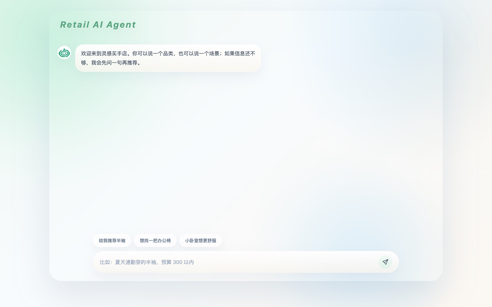
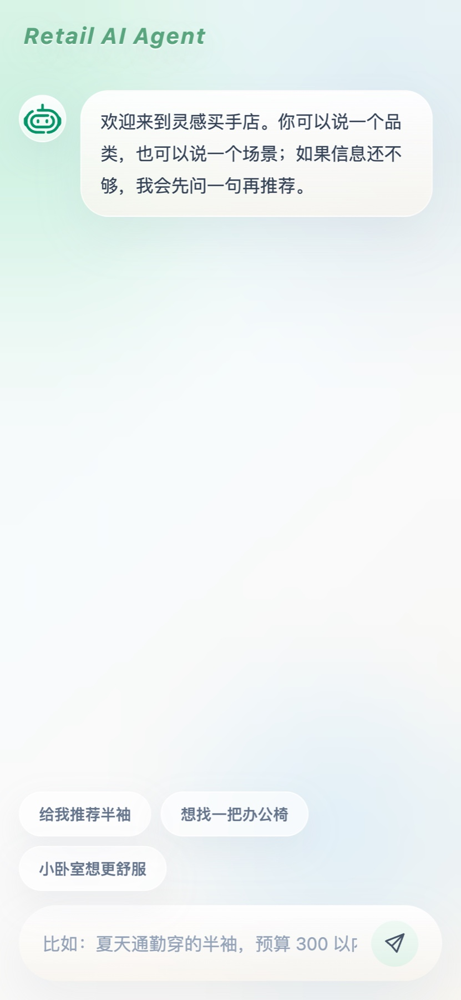
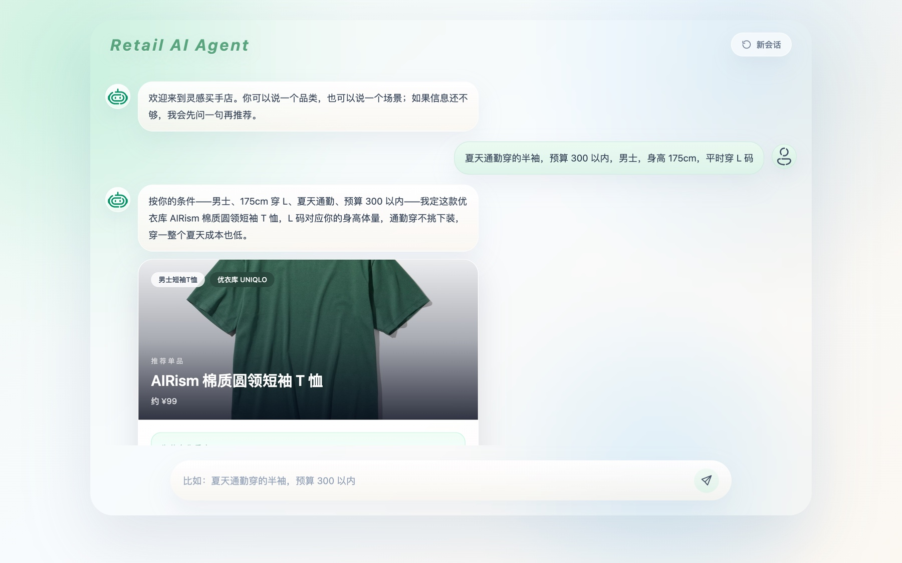
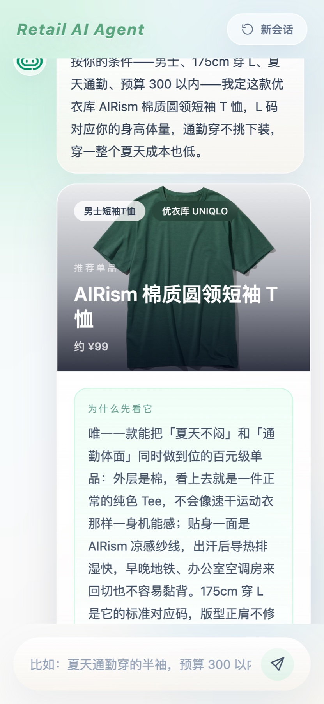
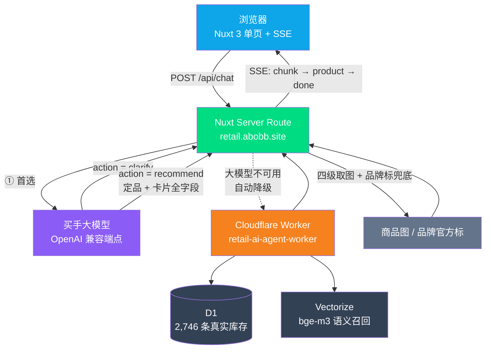

<div align="center">

# Retail AI Agent

**面向零售导购场景的 AI 推荐系统。中文自然语言进，一张真实在售商品卡出。**

首选由**买手大模型亲自定品** —— 它自己判断需求够不够、锁死一款真实型号、一次性产出卡片全字段；
只有当大模型不可用时，才自动降级到 **Cloudflare Worker + D1 + Vectorize** 的商品库 RAG 链路。

[**retail.abobb.site**](https://retail.abobb.site) &nbsp;·&nbsp; [retail.abobb.com](https://retail.abobb.com) &nbsp;·&nbsp; [Worker API](https://retail-ai-agent-worker.abobb-retail-ai-agent.workers.dev) &nbsp;·&nbsp; [Issues](https://github.com/abobb414/Retail-AI-Agent/issues)

[](./LICENSE)
[](#技术栈)
[](#架构)
[](#测试)
[](#架构)
[](#性能)

</div>

---

## 预览

<table>
<tr>
<td width="50%" align="center"><b>桌面端 · 首屏</b><br/></td>
<td width="50%" align="center"><b>移动端 · 首屏</b><br/></td>
</tr>
<tr>
<td width="50%" align="center"><b>桌面端 · 一轮问答的产物</b><br/></td>
<td width="50%" align="center"><b>移动端 · 一轮问答的产物</b><br/></td>
</tr>
</table>

> 上排是首屏（欢迎语 + 三个场景快捷入口），下排是**一次真实问答**：用户说「夏天通勤穿的半袖，预算 300 以内，男士，身高 175cm，平时穿 L 码」，
> 由买手大模型直接锁定型号并产出卡片。四张图均取自线上 `retail.abobb.site`，未经修饰。

---

## 特性

### 🎯 两级定品链路

这个项目不是电商搜索框，也不是只会闲聊的客服机器人。它验证的是更接近**线下导购**的体验：

| | 首选：买手大模型定品 | 兜底：商品库 RAG |
|---|---|---|
| **做什么** | 判断需求是否完整 → 锁定一款真实在售型号 → 产出卡片全字段 | D1 精确召回优先，Vectorize 语义召回兜底 |
| **依赖大模型吗** | 是 | **完全不依赖** |
| **中转站挂了** | 一起挂 | **照样出卡片** |
| **实测耗时** | 快路径 ~8s；含取图与质检的完整路径 30～70s | **0.18s** |

两级是**串联**的：首选失败（网络失败 / 超时 / JSON 不合法 / 字段不完整）才走兜底。
正常路径上兜底连碰都不会碰，零额外延迟。只有**两条链路同时**不可用才返回 503，
且错误文案里分别给出两条链路各自的原因，不给一句笼统的「失败了」。

### 🧠 什么时候追问，什么时候定品

- 信息不足时**只问一个最关键的问题**（比如「男士还是女士穿？身高体重或常穿尺码也给我一个」），不出卡片。
- 信息足够时直接定品，并给出针对用户场景的理由、适配与不适配人群、下一步怎么选。
- 提示词明确要求：**商品型号、参数、价格不得编造**。
- 多轮会话里的预算、人群、品类约束会被继承，但不会把上一轮的需求错误带进下一轮独立选品。
- 模型偶发「忘记输出 JSON、直接回一段散文」时，这段散文会被**回收为追问正文**，不判为故障。

### 🖼️ 商品图：四级取图 + 品牌标兜底

模型给的 `image` 一律留空，图片由后端自己找，分四级：

| 级 | 来源 | 说明 |
|---|---|---|
| ① | 来源页 `og:image` | 实地回抓 `source_url`，带 SSRF 守卫、逐跳校验重定向、512KB 截读 |
| ② | 品牌官方域图 | 来源页拿不到时，从品牌官方域取 |
| ③ | 品牌官方域定向匹配 | 候选图的描述里必须点名目标型号 |
| ④ | 第三方图 | 必须过**视觉质检**（把图真的发给多模态模型看水印 / 型号 / 是否商品实拍） |

四级全空时退到**品牌官方标**（官方域 favicon / 官网 `og:image`，真解析像素、`MIN_LOGO_SIDE = 32` 闸门），
卡片切成「标识 + 型号」版式；连标都探不到才显示文字占位。**错图比无图更难被发现，所以宁可留空。**

### 🔗 「查看官网」按钮永远在

图片核验的结论**只决定「用不用这张图」，不决定「给不给这个入口」**。
即使图片被全部拒掉、链接被判定过期，官网入口依然保留 —— 这是刻意解耦的设计，理由见[工程笔记](#工程笔记那些踩过的坑)第 2 条。

### ⚡ 抖动不打扰用户

- 同一 provider 连续失败 3 次进入 **90 秒熔断冷却期**，不让用户反复空等超时。
- 传输层抖动（`fetch failed` / `ECONNRESET` / `socket hang up`）退避重试 3 次；**超时类错误不重试**。
- 降级期间前端只显示统一的三点等待动画，**不暴露任何内部流程细节** —— 不展示服务来源徽章、不展示内部阶段名。
  （`meta.engine` 仍然下发给前端，但只用于内部状态与故障排查。）

---

## 工程笔记：那些踩过的坑

这个项目有 6000 多行前端代码 + 1500 多行 Worker 代码，但相当一部分行数花在了**看起来不重要、实际会要命的地方**。以下每一条都是真实踩过的：

<table>
<tr><th width="30%">症状</th><th width="70%">根因与解法</th></tr>
<tr>
<td><b>第三方站的 favicon 冒充「品牌官方标」</b></td>
<td>品牌标探测为了零延迟，<b>在来源核验之前</b>就并行发起了 —— 那一刻 <code>source_url</code> 还是模型给的原始地址，经常是第三方页。于是什么值得买 / 京东 / 知乎的 favicon 被当成品牌标贴上了商品卡。<br/><b>把第三方站点的标当品牌背书，比没有图更糟。</b>修法是加一道 <code>isBrandOfficialHost</code> 门槛，非官方域一律不进候选；探不到就老实留空。<br/>教训：<b>并行优化会让「这个字段已经过校验」这类时序假设静默失效</b> —— 注释里的前提必须跟着执行顺序一起复查。</td>
</tr>
<tr>
<td><b>「查看官网」按钮整块消失</b></td>
<td>来源核验的原逻辑是「404 就把 <code>source_url</code> 和图片一起清掉」「重定向后无图则链接也不认」。在只有图片一个消费方时看着合理，但前端按钮是 <code>v-if="source_url"</code> ⇒ <b>清空链接 = 按钮整块消失</b>，冷门品牌的官网入口命中率因此掉到接近 0。<br/>解法是把两件事<b>解耦</b>：核验只决定「用不用这张图」，不决定「给不给这个入口」。修后连续两轮跑批均为 8/8。</td>
</tr>
<tr>
<td><b>ICO 里明明有 32×32，却判成「太小」丢掉</b></td>
<td>ICO 是容器，一个文件可以同时装 16×16 和 32×32。只读第 1 个目录项就会把好标误杀（某个相机品牌的 ICO 正是如此）。必须<b>遍历全部目录项取最大边</b>。</td>
</tr>
<tr>
<td><b>按字节数猜分辨率，两头都猜错</b></td>
<td>473 字节的图标可能是合法的 16×16，而 3KB 的 ICO 也可能还是 16×16。字节数不是分辨率判据 —— 改成<b>真正解析像素</b>，再设 <code>MIN_LOGO_SIDE = 32</code> 闸门。</td>
</tr>
<tr>
<td><b>返回 200，但不是图</b></td>
<td><code>*/favicon.ico</code> 有返回 <code>200 + text/html</code> 的，也有 ICO 容器里装的其实是 PNG 的。上闸门之前先做 <b>magic number 嗅探</b>。</td>
</tr>
<tr>
<td><b>图片质检的超时值，实际只作用在「失败」的样本上</b></td>
<td>同一批候选是<b>并行</b>判定的，批次墙钟 = 最慢的那一张；而判不出来的那张一定会顶满上限。设 25s，等于一个坏样本就把整批拖住 25s（日志里连着三次 <code>judgeMs:25005</code> + aborted，单个用例质检累计 58.9s）。收到 12s 后最坏批次砍掉一半多，代价（极少数 12～25s 的慢成功）由品牌标兜底接住。</td>
</tr>
<tr>
<td><b>预算闸门卡错位置，把好图一起丢</b></td>
<td>找图阶段的总预算闸门<b>只能卡「层级起点」，绝不能卡单张质检</b>。试过卡单张：官方域定向取图一次就吃掉全部预算，后面<b>整批</b>质检全被判「预算用尽」而拒绝，连本来能过的好图一起丢。</td>
</tr>
<tr>
<td><b>改了默认值却不生效</b></td>
<td>代码默认 15s、<code>.env</code> 里写着 25s —— 生效的是 25s，而我只改了其中一处。<code>.env</code> 会覆盖代码默认值，最后靠日志里的真实毫秒数才定位到。</td>
</tr>
<tr>
<td><b>传输抖动被当成「上游挂了」</b></td>
<td>同一分钟内，中转站、图片源等<b>互不相干的多台主机同时</b> <code>fetch failed</code> ⇒ 不是上游服务不稳，是<b>本机出网链路在成片抽风</b>（可持续十几秒），原来的「只重试一次 + 固定 800ms」必然扛不住。<br/>改成退避 <code>[800, 1600]ms</code> 重试 3 次，并加一条反直觉规则：<b>慢失败不重试</b> —— 单次尝试已经花掉 ≥5s 就说明链路本身不通，否则 3 × 40s 能把用户拖到两分钟。同时把 undici 压成一整句的 <code>fetch failed</code> 沿 <code>error.cause</code> 链逐层展开，不然排查只能靠猜。</td>
</tr>
<tr>
<td><b>模型用「散文」回话，被判成服务不可用</b></td>
<td>模型在「该定品还是该追问」上本身就不稳，有时直接用自然语言问一句、不吐 JSON。把整条请求判成「大模型暂时不可用」是<b>误报</b> —— 模型好得很，只是没吐 JSON。改成：重试后仍非 JSON 且内容非空 ⇒ <b>回收为追问正文</b>；只有内容真的为空才抛错。</td>
</tr>
<tr>
<td><b>推理模型「看起来没有视觉」</b></td>
<td><code>content</code> 返回空串 + <code>finish_reason=length</code>，答案其实写在 <code>reasoning_content</code> 里。换成图片请求后思考更长、更容易触发，而症状（空字串）极易被读成「模型没有视觉能力」。把 <code>max_tokens</code> 提到 4096 后同一请求正常作答 —— <b>别拿「返回空 content」当成模型没能力</b>。</td>
</tr>
<tr>
<td><b>型号词元把主机名和尺寸当成型号</b></td>
<td><code>g-search3.alicdn.com</code> 被抽出 <code>SEARCH3</code>、<code>ATS-909X2</code> 里的 <code>9X2</code> 被当成尺寸 —— 结果是候选图被「型号冲突」<b>静默丢掉</b>：8 个冷门品牌 0 张图过闸，而日志上看不出任何异常。<br/>修法：抽词元前先剥掉 hostname；尺寸正则改成 <code>\d{2,5}[xX×]\d{2,5}</code>（两侧都要求 ≥2 位）；匹配语义从「相等」改为「包含」（URL 里的词元会和邻居粘连）。</td>
</tr>
<tr>
<td><b>「备用大模型」和「商品库兜底」被当成一回事</b></td>
<td>曾经把「API 只留一个供应商」过度理解成「整条兜底链路也一并摘掉」，删掉了防大模型崩溃的后路。两者性质完全不同：备用大模型是<b>同一个出口换个型号</b>（中转站抖动是链路级的，换模型救不回来），商品库兜底是<b>换一整套数据源</b>（不依赖任何大模型）。<br/>被删的那一刻，前端 <code>engine === 'catalog'</code> 的分支立刻变成走不到的死代码 —— 而前端一行都没改。</td>
</tr>
</table>

---

## 架构


```mermaid
flowchart TD
    U["浏览器<br/>Nuxt 3 单页 + SSE"] -->|"POST /api/chat"| N["Nuxt Server Route<br/>retail.abobb.site"]

    N -->|"① 首选"| L["买手大模型<br/>OpenAI 兼容端点"]
    L -->|"action = clarify"| N
    L -->|"action = recommend<br/>定品 + 卡片全字段"| N

    N -.->|"大模型不可用<br/>自动降级"| C["Cloudflare Worker<br/>retail-ai-agent-worker"]
    C --> D1[("D1<br/>2,746 条真实库存")]
    C --> VX["Vectorize<br/>bge-m3 语义召回"]
    C --> N

    N -->|"四级取图 + 品牌标兜底"| IMG["商品图 / 品牌官方标"]
    IMG --> N
    N -->|"SSE: chunk → product → done"| U

    style U fill:#0ea5e9,color:#fff
    style N fill:#00DC82,color:#fff
    style L fill:#8b5cf6,color:#fff
    style C fill:#f6821f,color:#fff
    style D1 fill:#334155,color:#fff
    style VX fill:#334155,color:#fff
    style IMG fill:#64748b,color:#fff
```

设计原则是**每一块都能独立降级**，任何外部依赖挂掉都不该让用户看到白屏或 5xx：

- **定品**：买手大模型 → 商品库 RAG（换一整套数据源，不依赖大模型）
- **商品图**：来源页 `og:image` → 品牌官方域图 → 官方域定向匹配 → 第三方图（过质检）→ 品牌官方标 → 文字占位
- **出网抖动**：退避重试 → 熔断冷却 → 降级
- **前端**：只有两条链路同时不可用才 503，且分别给出两条链路的失败原因

> ⚠️ 后端（`index.ts` 的 Worker + D1 + Vectorize）虽在本仓库内，但是**独立的 Cloudflare 项目**，
> 通过 `wrangler.jsonc` 单独部署，与 Vercel 上的前端解耦。

### 链路优先级

1. Nuxt 接收前端消息，先把完整对话交给买手大模型定品。
2. 大模型返回 `action = clarify` → 只抛出一个追问，不出卡片。
3. 大模型返回 `action = recommend` → 锁定唯一商品并一次性产出卡片全字段，Nuxt 直接映射为前端结构。
4. 大模型不可用时**自动降级到商品库兜底**，Worker 走「D1 精确召回优先 + Vectorize 语义兜底」。
5. `meta.engine` 为 `llm` / `catalog`，仅用于内部状态与故障排查；前端不展示任何来源徽章。

---

## 技术栈

| | |
|---|---|
| 前端 | Nuxt 3 · Vue 3 · Tailwind CSS（自建五档字号令牌 `ui-label / ui-meta / ui-body / ui-title / ui-display`） |
| 前端部署 | Vercel |
| API 代理 | Nuxt server route（`frontend/server/api/chat.post.ts`） |
| 首选定品 | 买手大模型（OpenAI 兼容 Chat Completions，默认 `deepseek-v4.1-flash`） |
| 商品图质检 | 同一条多模态链路（把候选图发给模型判断水印 / 型号 / 是否商品实拍） |
| 商品库兜底 | Cloudflare Worker + D1 + Vectorize + Workers AI Embedding（`bge-m3`） |
| 导入脚本 | Node.js + curl |

### 性能

| 指标 | 实测 |
|---|---|
| 兜底链路直连 Worker | **0.18s**（三次采样 0.19 / 0.17 / 0.18） |
| 首选链路 · 快路径 | **7.6s** 出首段文本 |
| 首选链路 · 完整路径（含取图与逐张质检） | 30～70s，方差大；长尾主要是图片阶段的并行墙钟 |
| 单张图质检 | 成功判定集中在 2.4～9.3s |
| 首屏 HTML（含内联样式） | 26.8 KB → gzip **7.5 KB** |
| 首屏 JS（两个 chunk） | 194 KB → gzip **73 KB** |

> 图片阶段为什么慢：候选图是**并行**判定、批次墙钟等于最慢的那一张，
> 而失败的那张一定会顶满超时上限。这就是为什么 `IMAGE_JUDGE_TIMEOUT_MS` 从 25s 收到 12s ——
> 它主要作用在失败样本上。见[工程笔记](#工程笔记那些踩过的坑)第 6 条。

---

## 快速开始

前端：

```bash
cd frontend
npm install
cp .env.example .env   # 填入 LLM_API_KEY 等
npm run dev            # → http://127.0.0.1:3000
```

Worker（可选，只在你要改兜底链路时）：

```bash
npx wrangler deploy --dry-run   # 先干跑
npx wrangler deploy
```

生产构建检查：

```bash
cd frontend
npm run build
```

> **说明**：Worker 兜底链路需要 `WORKER_CHAT_URL` 指向已部署的 Worker。
> 本地调试时如果留空，只有首选链路可用 —— 大模型失败时会直接报错，这是预期行为。

---

## 测试

两套：**离线回归**（不联网、无需 dev server）与**系统测试**（对运行中的实例打全链路）。

### 系统测试 · 7 场景 30 断言

| 场景 | 覆盖内容 |
|---|---|
| `S1` 静态服务 | 首页 HTTP 200、页面壳完整 |
| `S2` SSE 协议 | 事件序列合法、`data` 均为可解析 JSON、以 `done` 收尾、等待事件带 `pending` 且**不含内部文案** |
| `S3` 追问流程 | 信息不足时先问一句，且不出商品卡 |
| `S4` 定品流程 | 信息足够时锁定唯一商品，卡片关键字段齐全 |
| `S5` 多轮上下文 | 完整对话（问 → 答 → 补充预算）能接上 |
| `S6` 空输入兜底 | 空消息列表返回引导文案而非 5xx |
| `S7` 兜底链路 | `--fallback` 模式下断言 `engine=catalog` 且出真实卡片 |

```bash
node scripts/system-test.mjs https://retail.abobb.site
node scripts/system-test.mjs http://127.0.0.1:3100 --smoke      # 只跑 S1/S2/S6，不调大模型
node scripts/system-test.mjs http://127.0.0.1:3101 --fallback   # 对故障注入实例断言兜底链路
```

> 线上最近一次跑批：**30 通过 / 0 失败**。
> 注意 `S4` 依赖具体模型：模型当轮选择「追问」而不是「定品」时会红一次，换成「型号明确的问法」即稳定复现 —— 这不是链路故障。

### 离线回归

| 脚本 | 规模 | 钉住的是什么 |
|---|---|---|
| `test-natural-dialogues.mjs` | **30 例** | 自然对话回归：追问 / 定品 / 多轮的行为基线 |
| `test-catalog-intent.mjs` | **42 例**（21 profile + 21 clarify） | 品类、人群、预算的意图识别与追问话术 |
| `test-brand-logo.mjs` | **9 例** | 防第三方站 favicon 冒充品牌官方标（含 16 类第三方域必须被拦） |
| `test-image-model-tokens.mjs` | 5 例噪声 URL × 31 个噪声词 + 真型号 6 例 + 冲突判定 2 例 + 品牌词元 4 例 | 防「型号冲突误判」把好图全丢掉 |

```bash
node --experimental-strip-types scripts/test-brand-logo.mjs
node --experimental-strip-types scripts/test-image-model-tokens.mjs
node --experimental-strip-types scripts/test-catalog-intent.mjs
```

> `test-brand-logo.mjs` 会注册一个 `data:` URL 的 resolve 钩子，给源码里**无扩展名**的相对导入补 `.ts` 后缀 ——
> 裸 Node 的 ESM 解析器不认这种写法，而 Nuxt/Vite 认。这类 bug 在跑批输出里**只体现为「图床是第三方域」，极易被读成噪声**，所以必须有测试钉住。

### 端到端与探测

```bash
# 冷门 / 长尾产品端到端：定品 + 选图 + 官网按钮 + 耗时
node scripts/test-cold-products.mjs 3100
node scripts/test-cold-products.mjs 3100 --only=手冲壶

# 视觉能力探测：中转站上的模型到底能不能看图（含带图 / 不带图对照组）
node scripts/probe-vision.mjs <baseUrl> <apiKey> <model> [imagePath]
```

---

## 目录结构

```text
.
├── index.ts                         # Cloudflare Worker：导入、清洗、RAG 检索、商品锁定
├── wrangler.jsonc                   # Worker / D1 / Vectorize / Workers AI 绑定
├── catalogTaxonomy.ts               # 商品分类与属性词表
├── migrations/
│   ├── 001_expand_products_for_rag.sql
│   └── 002_catalog_facets.sql
├── scripts/                         # 测试、导入、探测（详见 scripts/README.md）
│   ├── system-test.mjs              # 系统测试：7 场景 30 断言
│   ├── test-natural-dialogues.mjs   # 离线回归：自然对话 30 例
│   ├── test-catalog-intent.mjs      # 离线回归：品类意图 42 例
│   ├── test-brand-logo.mjs          # 离线回归：品牌标域名候选 9 例
│   ├── test-image-model-tokens.mjs  # 离线回归：型号词元抽取
│   ├── test-cold-products.mjs       # 端到端：冷门长尾产品
│   ├── probe-vision.mjs             # 视觉能力探测
│   ├── import-real-products.mjs     # 批量导入商品到 D1 + Vectorize
│   ├── normalize-product-catalog.mjs# 从真实商品库生成结构化分类与属性
│   └── migrate-products-schema.mjs  # D1 表结构升级
├── frontend/
│   ├── pages/index.vue              # 主聊天界面
│   ├── composables/useChat.ts       # SSE 聊天状态管理
│   ├── components/                  # 消息列表、输入栏、推荐卡片、快捷入口
│   ├── server/api/chat.post.ts      # 大模型优先定品 → 商品库兜底
│   ├── server/api/image.get.ts      # 商品图代理（SSRF 守卫）
│   ├── server/utils/
│   │   ├── llmBuyer.ts              # 买手定品 provider 层（工具调用 / 超时 / 容错 / 熔断 / 取图编排）
│   │   ├── sourcePage.ts            # 来源核验：回抓商品页、抓 og:image、剔除死链
│   │   ├── imageJudge.ts            # 商品图视觉质检
│   │   ├── imageTrust.ts            # 官方域规则与图片可信度闸门
│   │   ├── brandLogo.ts             # 品牌官方标候选与探测
│   │   ├── modelTokens.ts           # 型号词元抽取与冲突判定
│   │   ├── transport.ts             # 出网重试 / 退避 / 错误展开
│   │   └── catalog*.ts              # 兜底链路的分类、意图与过滤
│   ├── server/data/                 # 商品数据源 + 结构化 facets
│   └── assets/css/main.css          # 五档字号令牌
├── docs/
│   ├── PRD.md
│   └── images/                      # README 预览图
├── CHANGELOG.md
├── LICENSE
└── README.md
```

---

## 环境变量

### 前端 / Vercel

```env
# 首选：买手定品大模型（OpenAI 兼容端点）
LLM_API_KEY=your_llm_api_key
LLM_BASE_URL=https://e-flowcode.cc/v1
LLM_MODEL=deepseek-v4.1-flash
LLM_TIMEOUT_MS=40000

# 商品图视觉质检：把候选图真的发给多模态模型判断水印 / 型号 / 是否商品实拍
# 置 0 则关闭，退回「只认品牌官方域名」的老规则
IMAGE_JUDGE=1
IMAGE_JUDGE_MODEL=                 # 留空则复用 LLM_MODEL
IMAGE_JUDGE_TIMEOUT_MS=12000

# 🔴 兜底：商品库链路（大模型不可用时接手定品，保证还能出卡片）。这是后路，别删。
WORKER_CHAT_URL=https://retail-ai-agent-worker.abobb-retail-ai-agent.workers.dev/api/chat
# 可选：把 Worker 域名固定到该 IP，绕开国内 DNS 解析问题。本地调试建议留空走正常 DNS
WORKER_RESOLVE_IP=
```

### Worker Bindings

在 [`wrangler.jsonc`](wrangler.jsonc) 中配置：

| Binding | 资源 |
|---|---|
| `env.DB` | D1 database `retail-ai-agent-db` |
| `env.VECTOR_INDEX` | Vectorize index `retail-ai-agent-products-bge-m3` |
| `env.AI` | Workers AI（Embedding） |

### 模型选型参考

同一份定品请求的实测耗时：`deepseek-v4.1-flash` **6.2s**、`doubao-seed-2.0-lite` 6.7s、
`qwen3.8-flash` 37.9s、`glm-5.3-flash` 39～92s（推理型，`max_tokens` 易被思考过程吃光）。
换成推理型模型时记得同步调大 `LLM_TIMEOUT_MS`。

**视觉能力要逐型号实测，别按系列推断**：

| 模型 | 带图请求 | 结果 |
|---|---|---|
| `glm-5.3-flash` | `image_url`（Base64 Data URL 或远程 URL） | ✅ 正常识别，2MB 大图也能进 |
| `deepseek-v4.1-flash` | `image_url` | ✅ 正常识别 |
| `glm-5.3` | `image_url` | ❌ HTTP 400 —— **同族却没有视觉** |

> `usage.prompt_tokens_details.image_tokens` 在中转站上恒为 `0`，**不能**用来判断图有没有进去。
> 产品侧目前还没有图片输入入口（仅文本输入），服务端也不组装 `image_url` 内容块 —— 模型能看图 ≠ 应用能用图。

---

## API 契约

### Frontend Proxy · `POST /api/chat`

```json
{ "messages": [{ "role": "user", "content": "男士通勤半袖100元以内" }] }
```

响应为 SSE：

| 事件 | 内容 |
|---|---|
| `chunk` | 导购回复文本 |
| `product` | 前端推荐卡片数据 |
| `meta` | 阶段与降级原因（内部状态，前端不展示来源徽章） |
| `done` | 流结束 |
| `error` | 错误信息 |

定品开始前会先发一条 `{ "pending": true, "stage": "thinking" }`，前端只显示统一的三点等待动画，不渲染任何等待文案。

降级到商品库时 `meta` 形如：

```json
{
  "mode": "catalog",
  "engine": "catalog",
  "stage": "rag_recommendation",
  "fallback_reason": "大模型定品失败：deepseek-v4.1-flash 处于熔断冷却期",
  "profile_summary": []
}
```

### Worker Chat · `POST /api/chat`

```json
{ "message": "男士通勤半袖100元以内" }
```

返回 `chat_reply` + `recommended_product`（含 `name` / `brand` / `price_display` / `image` / `url` / `why_buy` / `next_step_tip`）与 `stage`。

---

## 数据导入与迁移

```bash
# 升级 D1 商品表
D1_DATABASE_NAME=retail-ai-agent-db node scripts/migrate-products-schema.mjs

# 小批量烟测导入
WORKER_URL=https://<worker> LIMIT=5 BATCH_SIZE=8 CONCURRENCY=1 \
  node scripts/import-real-products.mjs

# 断点续跑
WORKER_URL=https://<worker> START_INDEX=500 BATCH_SIZE=8 CONCURRENCY=1 \
  node scripts/import-real-products.mjs
```

详细参数见 [scripts/README.md](scripts/README.md)。

---

## 部署

```bash
# 前端（Vercel Project 的 Root Directory 设为 `frontend`）
cd frontend && vercel deploy --prod --yes

# Worker
npx wrangler deploy
```

---

## 质量边界

**已处理**

- 首选链路失败自动降级商品库，并用连续失败熔断避免反复空等超时。
- 推理模型 `content` 被思考过程挤空时自动加大 `max_tokens` 重试。
- 中转站 Cloudflare 拦截（异常 UA 返回 403）已在服务端请求头规避。
- 多轮预算串联修复；显式品类、人群和预算硬过滤（兜底链路）。
- 模型偶发「散文回话」回收为追问正文，不判故障。
- 传输层抖动自动退避重试，**慢失败不重试**。
- 商品图四级取图 + 品牌标兜底 + 文字占位，链路上任何一环挂掉都不影响出卡片。

**仍可增强**

- **首选链路的商品真实性缺少校验**：模型仍可能给出不存在或已停售的型号。
- **最坏延迟偏高**：目前是「首选失败 → 才走兜底」的串行降级，最坏情况是 `LLM_TIMEOUT_MS` 跑满再叠加兜底。
  可改成 hedged request（首选发出 8s 未回就并行发起兜底，谁先成功用谁）把最坏延迟也压下来。
- **图片阶段方差大**：批次墙钟等于最慢的那张候选图，长尾可达 70s。可取的方向是把取图与定品**真正并行**，
  或先出文字卡、图片后到再补。
- **品牌标兜底命中率有限**：只有能探到品牌官方域图标时才生效；部分官方域在特定网络环境连不上，此时显示文字占位。
- **会话状态无持久化**：锁定状态完全依赖模型在每轮重新读取对话历史。
- 把 `category` 做成 D1 正式字段而不是运行时推导；增加请求日志、召回命中解释与可观测面板。
- 引入速率限制、鉴权和更完整的生产安全策略。

---

## 文档

- [产品需求 PRD](docs/PRD.md)
- [更新日志 CHANGELOG](CHANGELOG.md)
- [脚本说明](scripts/README.md)

## License

[MIT](./LICENSE)

<div align="center"><sub>商品数据来自公开在售渠道，仅用于导购链路演示；商品图与品牌标识版权归各品牌方所有。</sub></div>
