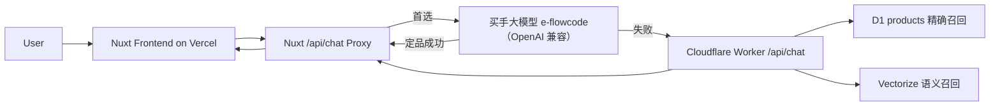

# Retail AI Agent

Retail AI Agent 是一个面向零售导购场景的 AI 推荐系统。链路优先级为 **买手大模型亲自定品 → 真实商品库兜底**：首选由买手大模型判断需求是否完整、锁定一款真实在售商品并产出卡片全字段；只有当大模型不可用时，才自动降级到 Cloudflare Workers + D1 + Vectorize 构成的商品库检索链路。用户用自然语言表达需求，最终拿到可直接渲染的导购回复与商品卡片。

线上演示：

- Frontend: [https://retail.abobb.site](https://retail.abobb.site)
- Worker API: [https://retail-ai-agent-worker.abobb-retail-ai-agent.workers.dev](https://retail-ai-agent-worker.abobb-retail-ai-agent.workers.dev)


## 项目定位

这个项目不是传统电商搜索框，也不是只会闲聊的客服机器人。它验证的是一个更接近线下导购的体验：

- 信息不足时先追问关键条件，而不是立即硬推商品。
- 信息足够时，由大模型直接锁定一款真实在售的具体型号，并给出针对用户场景的理由。
- **两级链路**：首选买手大模型（e-flowcode）亲自定品；它不可用时自动降级到 **Cloudflare Worker
  商品库兜底**（D1 + Vectorize 真实库存），保证不会因为大模型抖动而完全出不了卡片。
- 提示词明确要求：**商品型号、参数、价格不得编造**。
- 拿不到官方商品图时，退回**品牌官方标**（官方域 favicon / 官网 `og:image`）呈现，而不是死磕图片。
- 「查看官网」按钮**始终保留** —— 图片核验只决定「用不用这张图」，不决定「给不给这个入口」。

更完整的产品需求见 [docs/PRD.md](docs/PRD.md)；全模态改造思路见 [docs/multimodal_retail_agent_architecture.md](docs/multimodal_retail_agent_architecture.md)。

## 当前能力

- 支持中文自然语言导购，例如“男士通勤半袖 100 元以内”“小卧室想更舒服，灯光 300 元”。
- 首选链路：大模型自主判断信息是否足够，不足时只问一个最关键的问题；足够时直接定品并产出卡片全字段。
- 同一 provider 连续失败 3 次进入 90 秒熔断冷却期，不让用户空等超时。
- 支持多轮会话中的预算、人群和品类约束，不会把上一轮需求错误带入下一轮独立选品。
- 商品图分四级取：来源页 `og:image` → 品牌官方域图 → 品牌官方域定向匹配 → 第三方图（需过视觉质检）；
  全空时退到**品牌官方标**。
- 前端通过 SSE 渲染对话文本、商品卡片、推荐状态和重置会话。

## 架构概览


```mermaid
flowchart LR
    U["User"] --> V["Nuxt Frontend on Vercel"]
    V --> N["Nuxt /api/chat Proxy"]
    N -->|首选| L["买手大模型 e-flowcode（OpenAI 兼容）"]
    L -->|定品成功| N
    L -->|失败| C["Cloudflare Worker /api/chat"]
    C --> D1["D1 products 精确召回"]
    C --> VX["Vectorize 语义召回"]
    C --> N
    N --> V
```

### 链路优先级

1. Nuxt 接收前端消息，先把完整对话交给买手大模型定品。
2. 大模型返回 `action = clarify` 时，只抛出一个追问，不出卡片。
   （模型偶发「忘记输出 JSON、直接回一段散文」时，这段散文会被**回收为追问正文**，不判为故障。）
3. 大模型返回 `action = recommend` 时，锁定唯一商品并一次性产出卡片全字段，Nuxt 直接映射为前端结构。
4. 大模型不可用（网络失败 / 超时 / JSON 不合法 / 字段不完整）时，**自动降级到商品库兜底** ——
   Cloudflare Worker 走「D1 精确召回优先 + Vectorize 语义兜底」，返回一款真实在售商品。
   降级期间前端统一显示三点等待动画，不暴露任何内部流程细节。
5. 只有两条链路**同时**不可用，才返回 503，且文案里分别给出两条链路各自的原因。
6. `meta.engine` 为 `llm` / `catalog`，仅用于内部状态与故障排查；前端**不展示**任何服务来源徽章或内部流程细节。

### 关于两条链路的取舍

首选是买手大模型（e-flowcode），兜底是 `index.ts` + `wrangler.jsonc` 部署的
Cloudflare Worker（D1 + Vectorize + Workers AI Embedding）。

一个容易踩的取舍误区：**「备用大模型」和「商品库兜底」性质完全不同，不能合并处理**。

| | 备用大模型 `LLM_FALLBACK_*` | 商品库兜底 Worker + D1 + Vectorize |
| --- | --- | --- |
| 换的是什么 | 同一个出口换个模型 | 换**一整套数据源** |
| 依赖大模型吗 | 依赖（同一个中转站） | **完全不依赖** |
| 中转站挂了 | 一起挂（抖动是链路级的） | **照样出卡片** |
| 结论 | 冗余，可砍（已移除） | 可用性保险，**必须保留** |

实测背景：一次网络抖动让中转站、图片源等多台互不相干的主机在同一分钟里全部 `fetch failed`
—— 换模型救不回来，只增加延迟。而兜底链路直连 Worker 端点 **0.6s** 返回，给出的是 D1 里
人工核过的真实商品（UNIQLO T恤 ¥79、IKEA 灯 ¥99.99），**带图、带官网链接**，不依赖任何大模型。
因此本项目只保留一档大模型配置，可用性由商品库兜底承担。

## 技术栈

| 层级 | 技术 |
| --- | --- |
| 前端 | Nuxt 3, Vue 3, Tailwind CSS |
| 前端部署 | Vercel |
| API 代理 | Nuxt server route |
| 首选定品 | 买手大模型（OpenAI 兼容 Chat Completions，默认 `deepseek-v4.1-flash`，出口 `e-flowcode`） |
| 图片质检 | 同一条多模态链路（把候选图发给模型判断水印 / 型号 / 是否商品实拍） |
| 商品库兜底 | Cloudflare Worker + D1 + Vectorize + Workers AI Embedding（大模型不可用时接手定品） |
| 导入脚本 | Node.js + curl |

## 项目结构

```text
.
|-- index.ts                         # Cloudflare Worker: 导入、清洗、RAG 检索、商品锁定
|-- wrangler.jsonc                   # Worker、D1、Vectorize、Workers AI 绑定
|-- migrations/
|   |-- 001_expand_products_for_rag.sql
|   `-- 002_catalog_facets.sql
|-- scripts/
|   |-- normalize-product-catalog.mjs # 从真实商品库生成结构化分类与属性
|   |-- import-real-products.mjs      # 批量导入商品到 D1 + Vectorize
|   |-- migrate-products-schema.mjs   # D1 表结构升级脚本
|   `-- README.md
|-- frontend/
|   |-- pages/index.vue               # 主聊天界面
|   |-- composables/useChat.ts        # SSE 聊天状态管理
|   |-- components/                   # 消息、输入栏、推荐卡片、状态栏
|   |-- server/api/chat.post.ts       # Nuxt 代理：大模型优先定品 → 商品库兜底
|   |-- server/api/image.get.ts       # 商品图代理
|   |-- server/utils/llmBuyer.ts      # 买手定品 provider 层（工具调用/超时/容错/熔断）
|   |-- server/utils/sourcePage.ts    # 来源核验层：回抓商品页、抓 og:image、剔除死链
|   |-- server/utils/imageJudge.ts    # 商品图视觉质检
|   |-- server/utils/brandLogo.ts     # 品牌官方标候选与官方域规则
|   |-- server/data/realProducts.json # 商品数据源
|   |-- nuxt.config.ts
|   `-- vercel.json
|-- docs/
|   |-- PRD.md
|   `-- images/
|-- CHANGELOG.md
|-- LICENSE
`-- README.md
```

## 环境变量

### Nuxt / Vercel

```env
# 首选：买手定品大模型（OpenAI 兼容端点）
LLM_API_KEY=your_llm_api_key
LLM_BASE_URL=https://e-flowcode.cc/v1
LLM_MODEL=deepseek-v4.1-flash
LLM_TIMEOUT_MS=40000

# 商品图视觉质检：把候选图真的发给多模态模型判断水印 / 型号 / 是否商品实拍
# 置 0 则关闭，退回「只认品牌官方域名」的老规则
IMAGE_JUDGE=1
IMAGE_JUDGE_MODEL=
IMAGE_JUDGE_TIMEOUT_MS=12000

# 🔴 兜底：商品库链路（大模型不可用时接手定品，保证还能出卡片）。这是后路，别删。
WORKER_CHAT_URL=https://retail-ai-agent-worker.abobb-retail-ai-agent.workers.dev/api/chat
# 可选：把 Worker 域名固定到该 IP，绕开国内 DNS 解析问题。本地调试建议留空走正常 DNS
WORKER_RESOLVE_IP=
```

> **为什么只有一档大模型、却必须留 Worker 兜底？**
> 备用大模型（`LLM_FALLBACK_*`）和首选是**同一个中转站、同一套协议**，中转站抖动是链路级的
> —— 换模型救不回来，只增加延迟，所以已移除。
> 而 `WORKER_CHAT_URL` 指向的是**另一套数据源**（D1 真实库存 + Vectorize 向量召回），
> **不依赖任何大模型**，大模型整条链路崩了它照样出卡片 —— 这才是真正的兜底，必须留。

选模型时的实测参考（同一份定品请求）：`deepseek-v4.1-flash` 6.2s、`doubao-seed-2.0-lite` 6.7s、`qwen3.8-flash` 37.9s、`glm-5.3-flash` 39~92s（推理型，`max_tokens` 易被思考过程吃光）。要换成推理型模型，记得同步调大 `LLM_TIMEOUT_MS`。

**别拿「返回空 content」当成模型没能力。** 推理型模型会先写一大段 `reasoning_content`，`max_tokens` 给小了就被思考过程吃光，`content` 返回空串且 `finish_reason=length` —— 看起来像「模型没说话 / 没视觉」，其实答案就在 reasoning 里。把 `max_tokens` 提到 4096 即正常。

**视觉能力逐型号实测，别按系列推断**（实测于 `cn.chatapi.app` / `e-flowcode.cc` 两个中转站）：

| 模型 | 带图请求 | 结果 |
| --- | --- | --- |
| `glm-5.3-flash` | `image_url`（Base64 Data URL 或远程 URL） | ✅ 正常识别，2MB 大图也能进 |
| `deepseek-v4.1-flash` | `image_url` | ✅ 正常识别 |
| `glm-5.3` | `image_url` | ❌ HTTP 400 —— 同族却没有视觉 |

探测脚本：`node scripts/probe-vision.mjs <baseUrl> <apiKey> <model> [imagePath]`（含带图/不带图对照组，能区分「真没视觉」与「答案被 reasoning 挤空」）。
注意 `usage.prompt_tokens_details.image_tokens` 在中转站上恒为 `0`，不能用来判断图有没有进去。

> 产品侧目前**还没有**图片输入入口（`InputBar.vue` 仅文本），服务端也不组装 `image_url` 内容块 —— 模型能看图 ≠ 应用能用图。

### 来源核验与商品图

模型给的 `source_url` / `image` 都只当线索，不当事实。定品完成后由后端实地回抓一次（[sourcePage.ts](frontend/server/utils/sourcePage.ts)，带 SSRF 守卫、逐跳校验重定向、512KB 截读）：

- 页面 404 → 链接是死的，清掉 `source_url` 与图片；
- 重定向到别的页且拿不到商品图 → 大概率已不是那款商品，链接也不认；
- 页面可达 → 用页面上的 `og:image` 作为商品图。

抓不到 `og:image` 时，退一步从候选图中按**型号词元匹配**挑一张（图片描述里必须点名目标型号）；仍不满足就留空，前端走无图版式。**错图比无图更难被发现，所以宁可留空。**

### 品牌官方标兜底

所有图片候选都不可用时，前端退到**品牌官方标**：按品牌名探测官方域 favicon / 官网 `og:image`。官方域规则表与候选生成逻辑见 [brandLogo.ts](frontend/server/utils/brandLogo.ts)。探测不到官方域时显示文字占位。

### Cloudflare Worker Bindings

这些绑定在 [wrangler.jsonc](wrangler.jsonc) 中配置：

- `env.DB`: D1 database `retail-ai-agent-db`
- `env.VECTOR_INDEX`: Vectorize index `retail-ai-agent-products-bge-m3`
- `env.AI`: Workers AI binding

## 本地开发

安装并启动前端：

```bash
cd frontend
npm install
npm run dev
```

前端默认访问：

- [http://127.0.0.1:3000](http://127.0.0.1:3000)

生产构建检查：

```bash
cd frontend
npm run build
```

Worker dry run：

```bash
npx wrangler deploy --dry-run
```

## 测试

测试脚本统一放在 `scripts/`（说明见 [scripts/README.md](scripts/README.md)）：

```bash
# 系统测试：7 场景 30 断言（静态服务 / SSE 协议 / 追问 / 定品 / 多轮上下文 / 空输入 / 兜底）
node scripts/system-test.mjs http://127.0.0.1:3100
node scripts/system-test.mjs http://127.0.0.1:3100 --smoke     # 快速冒烟，不调大模型
node scripts/system-test.mjs http://127.0.0.1:3101 --fallback  # 断言兜底链路（配故障注入实例）

# 冷门/长尾产品端到端：定品 + 选图 + 官网按钮 + 耗时
node scripts/test-cold-products.mjs 3100
node scripts/test-cold-products.mjs 3100 --only=手冲壶

# 离线单测：品牌官方域规则 / 图片型号词元
node scripts/test-brand-logo.mjs
node scripts/test-image-model-tokens.mjs

# 视觉能力探测（中转站上的模型到底能不能看图）
node scripts/probe-vision.mjs <baseUrl> <apiKey> <model>
```

兜底链路的故障注入测法：本地起一个 `LLM_BASE_URL` 指向不可达端口的实例，跑 `--fallback`
套件，断言 `engine=catalog` 且返回真实商品卡。

## 数据导入与迁移

升级 D1 商品表：

```bash
D1_DATABASE_NAME=retail-ai-agent-db node scripts/migrate-products-schema.mjs
```

小批量烟测导入：

```bash
WORKER_URL=https://retail-ai-agent-worker.abobb-retail-ai-agent.workers.dev \
LIMIT=5 \
BATCH_SIZE=8 \
CONCURRENCY=1 \
node scripts/import-real-products.mjs
```

断点续跑：

```bash
WORKER_URL=https://retail-ai-agent-worker.abobb-retail-ai-agent.workers.dev \
START_INDEX=500 \
BATCH_SIZE=8 \
CONCURRENCY=1 \
node scripts/import-real-products.mjs
```

## API 契约

### Frontend Proxy

`POST /api/chat`

请求：

```json
{
  "messages": [
    { "role": "user", "content": "男士通勤半袖100元以内" }
  ]
}
```

响应为 SSE：

- `chunk`: 导购回复文本
- `product`: 前端推荐卡片数据
- `meta`: 阶段与降级原因（内部状态，前端不展示来源徽章）
- `done`: 流结束
- `error`: 错误信息

`meta` 事件示例：

```json
{
  "mode": "llm",
  "engine": "llm",
  "model": "deepseek-v4.1-flash",
  "stage": "rag_recommendation",
  "latency_ms": 5500,
  "profile_summary": []
}
```

降级到商品库时为：

```json
{
  "mode": "catalog",
  "engine": "catalog",
  "stage": "rag_recommendation",
  "fallback_reason": "大模型定品失败：deepseek-v4.1-flash 处于熔断冷却期",
  "profile_summary": []
}
```

定品开始前会先发一条 `{ "pending": true, "stage": "thinking" }`，前端只显示统一的三点等待动画，不渲染任何等待文案。

### Worker Chat

`POST /api/chat`

请求：

```json
{
  "message": "男士通勤半袖100元以内"
}
```

响应：

```json
{
  "chat_reply": "这款男式短袖更贴近你的条件，可以先看。",
  "recommended_product": {
    "id": "muji-4548076062684",
    "name": "男式 天竺编织 圆领短袖T恤",
    "brand": "MUJI",
    "category": "T恤/短袖",
    "price_display": "CNY 78",
    "image": "https://...",
    "url": "https://...",
    "why_buy": "它属于短袖上衣，价格在 100 元预算内。",
    "ideal_for": [],
    "avoid_for": [],
    "next_step_tip": "下一步先看官网尺码、库存和实拍细节。"
  },
  "stage": "rag_recommendation"
}
```

## 部署

### Cloudflare Worker

```bash
npx wrangler deploy
```

### Vercel Frontend

Vercel Project 的 Root Directory 设置为 `frontend`。

```bash
cd frontend
vercel deploy --prod --yes
```

## 质量边界

已处理：

- 首选链路失败自动降级商品库，并用连续失败熔断避免反复空等超时。
- 推理模型 `content` 被思考过程挤空时自动加大 `max_tokens` 重试。
- 中转站 Cloudflare 拦截（异常 UA 返回 403）已在服务端请求头规避。
- 多轮预算串联修复。
- 显式品类、人群和预算硬过滤（兜底链路）。
- 新会话重置。
- 大模型偶发「忘记输出 JSON、直接回一段散文」时，回收为追问正文，不判为故障。
- 传输层抖动（`fetch failed` / `ECONNRESET` / `socket hang up`）自动退避重试，超时类错误不重试。

仍可增强：

- **品牌标兜底命中率有限**：只有能探到品牌官方域的图标时才生效（实测 Logitech / Ergotron / Casio /
  Nikon 等命中；部分官方域在当前网络环境连不上）。探不到时前端显示文字占位。
- 最坏情况仍是「首选超时跑满 + 再走兜底」的串行降级；可改成 hedged request 把最坏延迟也压下来。
- 首选链路的商品真实性缺少校验，模型仍可能给出不存在或已停售的型号。
- 会话状态无持久化：锁定状态完全依赖大模型在每轮重新读取对话历史。
- 将 `category` 作为 D1 正式字段，而不是运行时推导。
- 增加请求日志、召回命中解释和可观测面板。
- 为商品导入增加更细的失败批次恢复报告。
- 引入速率限制、鉴权和更完整的生产安全策略。

## 文档

- [PRD](docs/PRD.md)
- [更新日志](CHANGELOG.md)
- [导入脚本说明](scripts/README.md)

## License

[MIT License](LICENSE)
