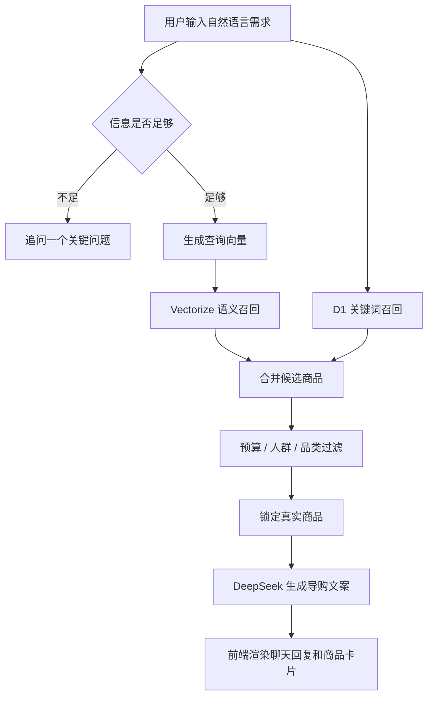

# Retail AI Agent PRD

## 1. 背景

传统电商搜索要求用户先知道商品名、品牌或明确品类。但真实购买决策经常从模糊需求开始，例如：

- “夏天上班想穿得舒服一点。”
- “小卧室想更有氛围。”
- “预算不高，想找一件日常能穿的半袖。”

Retail AI Agent 的目标是验证一种更像线下导购的线上体验：先理解用户场景，再追问关键条件，最后从真实商品库中推荐一个可购买、可解释、可渲染的商品。

## 2. 产品定位

Retail AI Agent 是一个零售导购 RAG 原型，面向多品牌、多品类商品库。

它承担三个角色：

- 需求澄清者：信息不足时追问性别、预算、场景或偏好。
- 商品检索者：从 D1 + Vectorize 商品库中召回真实候选。
- 导购表达者：用自然语言解释为什么推荐这款，以及什么人不适合买。

## 3. 目标用户

| 用户 | 需求 | 产品价值 |
| --- | --- | --- |
| 普通消费者 | 不知道具体买什么，只知道预算和使用场景 | 降低筛选成本，获得明确单品 |
| 零售品牌 | 希望 AI 推荐真实商品，不编造 SKU | 提升线上导购可信度 |
| 演示/评审对象 | 需要看到完整 AI 零售闭环 | 展示数据、检索、生成和前端卡片一体化能力 |
| 项目维护者 | 需要可扩展的技术底座 | 支持继续接入更多商品、索引和策略 |

## 4. 产品目标

### P0 目标

- 用户可以通过自然语言发起商品推荐。
- 系统在条件不足时先追问，而不是盲目推荐。
- 系统能根据预算、人群、品类和场景命中真实商品。
- 推荐卡片必须展示真实商品图片、价格、官网链接和人群标签。
- 多轮会话中，用户开启新一轮独立需求时不被旧预算污染。

### P1 目标

- 推荐文案像真实导购，而不是模板化客服回复。
- 商品命中错误时可以通过规则和召回日志快速定位原因。
- 支持分批导入和断点续传完整商品库。

### 非目标

- 不做完整电商交易闭环。
- 不做用户登录、购物车和订单系统。
- 不做品牌后台商品管理。
- 不让 LLM 自由生成不存在的商品。

## 5. 核心体验流程



## 6. 用户故事

1. 作为用户，我想说“男士通勤半袖 100 元以内”，系统直接给我预算内男款短袖，而不是鞋子或女款。
2. 作为用户，我想先说“小卧室想更舒服”，系统不要立刻硬推商品，而是追问灯光、收纳、床品或小家具方向。
3. 作为用户，我想开始下一轮会话时一键清空上下文，避免上一轮预算继续影响下一轮。
4. 作为品牌方，我希望卡片里的图片、价格和官网链接都来自真实数据库，不被模型编造。
5. 作为演示者，我希望系统即使商品量较大，也能通过 D1 + Vectorize 做稳定召回。

## 7. 功能需求

| 编号 | 功能 | 优先级 | 验收标准 |
| --- | --- | --- | --- |
| FR-01 | 自然语言输入 | P0 | 用户可输入中文需求并收到 SSE 回复 |
| FR-02 | 信息不足追问 | P0 | 泛需求不直接出卡，只追问一个关键条件 |
| FR-03 | 预算解析 | P0 | 多个金额同时出现时，以最后一次明确预算为当前约束 |
| FR-04 | 人群过滤 | P0 | 男士请求不返回女款、童装、宠物商品 |
| FR-05 | 品类过滤 | P0 | 短袖请求不返回鞋子，鞋子请求不返回裤装 |
| FR-06 | 语义召回 | P0 | Worker 使用 Workers AI + Vectorize 召回相关商品 |
| FR-07 | D1 字段回捞 | P0 | 最终卡片字段来自 D1 商品行 |
| FR-08 | DeepSeek 文案润色 | P1 | 只润色导购文案，不修改真实商品字段 |
| FR-09 | 新会话重置 | P1 | 点击后清空历史消息、推荐卡、输入框和右侧摘要 |
| FR-10 | 导入脚本 | P1 | 支持 `LIMIT`、`START_INDEX`、`BATCH_SIZE` 和重试 |

## 8. 数据与字段约束

商品基础字段：

```json
{
  "id": "muji-4548076062684",
  "name": "男式 天竺编织 圆领短袖T恤",
  "brand": "MUJI",
  "price_range": "CNY 78",
  "source_url": "https://www.muji.com.cn/cn/store/#/commodity/103087",
  "image": "https://...",
  "feature": "男式圆领短袖T恤",
  "keywords": ["MUJI", "T恤", "短袖", "男式"],
  "ideal_for": ["日常通勤", "简约穿搭"],
  "avoid_for": ["需要速干功能的人"]
}
```

D1 `products` 表存储字段：

- `id`
- `vector_id`
- `name`
- `brand`
- `price`
- `price_display`
- `url`
- `description`
- `image`
- `ideal_for`
- `avoid_for`

真实字段锁定规则：

- DeepSeek 不允许修改 `id`、`name`、`brand`、`price_display`、`image`、`url`。
- 前端卡片展示优先使用 Worker/D1 字段。
- DeepSeek 失败时，系统回退到 Worker 确定性文案。

## 9. 推荐策略

### 9.1 澄清策略

当用户只给出模糊生活场景时，先追问方向：

- 穿搭类：追问人群、预算、场景。
- 家居类：追问空间、用途、预算。
- 家电类：追问容量、面积、安装条件、预算。

### 9.2 召回策略

系统采用混合召回：

- D1 关键词召回：商品名、品牌、描述、人群标签。
- Vectorize 语义召回：处理模糊表达和同义表达。
- 规则重排：预算、人群、品类是强约束。

### 9.3 多轮策略

如果最新用户消息已经包含明确品类、预算、人群或场景，则视为新一轮独立选品请求，只将最新消息传给 Worker。这样可以避免上一轮“灯光 300 元”污染下一轮“男士半袖 100 元以内”。

## 10. 非功能需求

| 类型 | 要求 |
| --- | --- |
| 稳定性 | 商品事实字段不被模型改写 |
| 可解释性 | 推荐卡片必须说明为什么推荐和谁不适合 |
| 性能 | 明确品类和预算的请求应优先走 D1/规则召回，减少不必要模型消耗 |
| 可恢复性 | 商品导入支持断点续跑 |
| 可部署性 | 前端部署到 Vercel，RAG 中枢部署到 Cloudflare Workers |
| 可维护性 | README、PRD、CHANGELOG 分工明确 |

## 11. 成功指标

| 指标 | 目标 |
| --- | --- |
| 预算串联错误 | 多轮独立请求中不沿用旧预算 |
| 显式品类错配 | 用户明确说短袖时不返回鞋子 |
| 商品事实准确率 | 卡片商品名、价格、图片、链接来自真实库 |
| 首轮追问质量 | 信息不足时只问一个关键问题 |
| 演示可用性 | 线上页面可稳定完成“提问 -> 推荐 -> 出卡” |

## 12. 当前已验证场景

- “男士通勤半袖 100 元以内”返回 `MUJI 男式 天竺编织 圆领短袖T恤 CNY 78`。
- “小卧室想更舒服，灯光预算 300 元”返回 IKEA 照明商品，品类显示为 `照明灯具`。
- 多轮历史包含“灯光 300 元”后，再问“男士半袖 100 元以内”，系统不再沿用 300 元预算。
- 点击“新会话”后，历史消息和推荐卡片清空。
