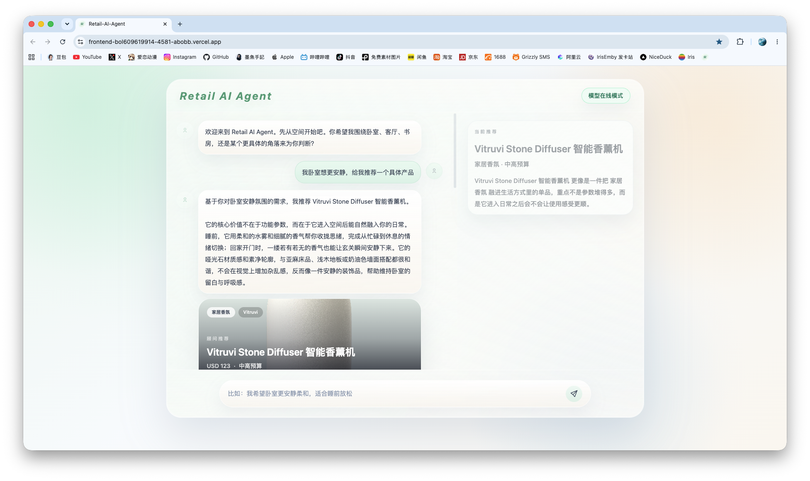

# Retail AI Agent Frontend



本地目录已关联到 Vercel 项目 `abobb/frontend`，线上地址：

- Frontend: https://frontend-bol609619914-4581-abobb.vercel.app
- Backend: https://backend-bol609619914-4581-abobb.vercel.app

## Run Locally

```bash
npm install
npm run build
npm run start:local
```

打开 http://127.0.0.1:3000

Vercel 项目配置使用 Node 24.x。当前这台 Mac 的默认 Node 是 25.x，`nuxt dev` 在 Node 25 下可能触发 vite-node IPC 的 `connect EINVAL`。可以临时用 Node 24 启动：

```bash
npm run dev:node24
```

## Notes

- `.vercel/` 已由 `vercel link` 和 `vercel pull` 生成，并被 `.gitignore` 忽略。
- Vercel 不会从部署 URL 反向提供完整源码；当前本地源码是根据线上 Nuxt 构建产物、页面结构、Vercel 项目配置和后端 OpenAPI 复刻出的可开发版本。
- 本地 `/api/chat` 现在直接调用 DeepSeek Chat Completions API，并把 DeepSeek 的流式响应转换成前端需要的 SSE 事件。
- 产品图片走本地 `/api/image` 同源代理，减少浏览器直连海外品牌 CDN 导致的加载失败。
- DeepSeek key 放在本地 `.env`，该文件已被 `.gitignore` 忽略，不要提交。
